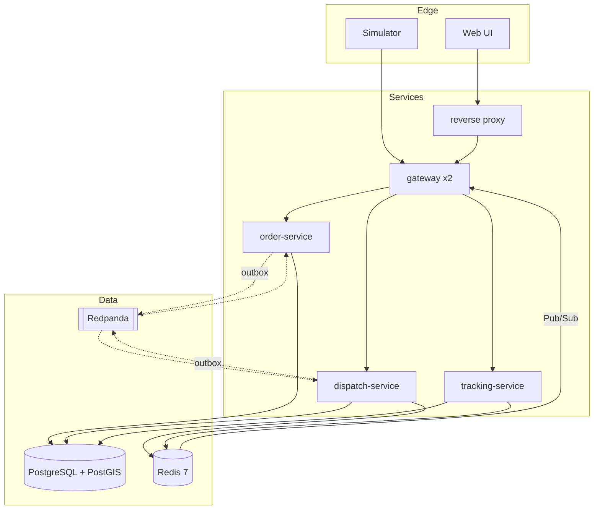
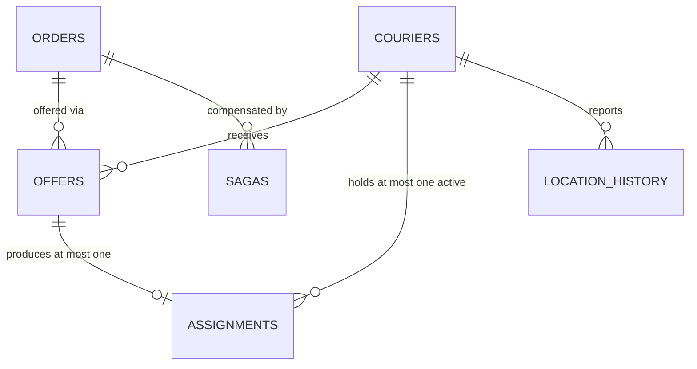

# Wassal — real-time courier dispatch

> Single source of truth for what this project is and how it is built.
> Generated by Project Forge, Phase 14. **Detail lives in `docs/` — this file summarises, it
> does not duplicate.** Regenerate it when the `docs/` set changes or an ADR is superseded.
> Last updated: **2026-08-09** (pre-Sprint-1 amendment pass — timeline reset, scope re-triage)

---

## What This Is

A dispatch engine that matches delivery orders to couriers in real time. An order arrives, the
system finds nearby available couriers, offers the job with a 15-second deadline, and assigns
on acceptance; declines and timeouts pass the offer onward, and cancellation returns the order
to the pool through a compensating saga.

**It is a portfolio and skills-development project, and that inverts the usual objective
function.** The system exists to produce *measurable evidence* of distributed-systems
correctness. The courier domain is the vehicle. **An architecture that ships the same features
more simply is a failed outcome here, not a win** (ADR-0001) — read the architecture with that
in mind or it looks like over-engineering.

Load comes from a first-class simulator: 300 deterministic couriers moving on real Tunis road
geometry with calibrated response behaviour.

---

## Business Goals

| Goal | Target |
|---|---|
| G-1 Concurrency correctness | Zero INV-1…INV-6 violations across ≥ 3 stress runs of ≥ 5 000 contended attempts |
| G-2 Failure correctness | Consistency restored < 30 s after a mid-operation kill, zero lost orders |
| G-3 Measured latency | p99 < 500 ms order→first offer, **published including misses** |
| G-4 One-command start | Cold clone → running in one command, < 2 min, CI-verified |
| G-5 Close three experience gaps | Kafka operations, distributed locking, WebSocket scaling — each exercised under load and failure |
| G-6 One honest bug story | ≥ 1 real defect caught by the proof suites, written up |

---

## Scope

**Building (committed, `v0.4.0`):** order intake · courier availability · geospatial candidate
search · offer lifecycle (offer/accept/decline/expire) · atomic assignment · cancellation saga ·
live tracking with cross-instance fan-out · delivery completion · the simulator with independent
ground truth · observability · the concurrency, chaos and idempotency proofs · the README.

**Not building** — these would otherwise get built by accident: payments · ratings · chat ·
multi-city · KYC · admin back-office · push notifications · **multi-order batching and route
optimisation** (an optimisation problem, not a distributed-systems one — the most tempting
rabbit hole here) · real mobile apps · authentication · high availability · backups · staging.

**Deferred, with triggers:** CDC via Debezium (when `outbox_publish_lag_p99 > 200 ms`; the
schema is already compatible) · geo-index sharding (30 000 couriers) · real auth (only if
public interaction is ever wanted).

**Stretch — outside committed scope** (ADR-0010), pulled in only if velocity allows: the
three-source reconciliation job (FR-017) and the k6 sustained-load report. **The hosted demo
is dropped**; the recorded walkthrough is the committed deliverable.

---

## Tech Stack

| Layer | Choice | ADR |
|---|---|---|
| Language / runtime | Java 21, Spring Boot 3.x | — (locked by brief) |
| Architecture style | Event-driven microservices — 4 services + simulator | ADR-0002 |
| Event backbone | Kafka (Redpanda locally), 2 topics | ADR-0002, ADR-0007 |
| Authoritative store | PostgreSQL 16 + PostGIS, schema per service | ADR-0002 |
| Candidate index | Redis 7 GEO, intersected with a Redis availability set | ADR-0003 |
| **Concurrency control** | **Postgres conditional UPDATE + partial unique indexes** — not a distributed lock | **ADR-0004** |
| Durable timers | Persisted `expires_at` + 250 ms sweeper, `SKIP LOCKED` | ADR-0005 |
| DB→Kafka | Transactional outbox, polling publisher (CDC deferred) | ADR-0006 |
| Real-time fan-out | Redis Pub/Sub, channel per order | ADR-0007 |
| Compensation | Orchestrated saga with persisted state | ADR-0008 |
| Observability | OpenTelemetry, Prometheus, Grafana | — |
| Testing | JUnit 5, Testcontainers, Toxiproxy, k6, ArchUnit | — |
| Frontend | React 18 + MapLibre GL, OSM tiles | — |
| Hosting | Local Compose; optional Hetzner CX32 ~€7.80/mo | ADR-0009 |

---

## Architecture

Event-driven microservices, chosen against the modular-monolith default because a monolith
removes the conditions under which four of the five target properties are even *observable* —
an in-process call cannot arrive twice, out of order, or after the caller died.

**The organising principle, which recurs in five decisions: _the index may lie; the claim
cannot._** Redis holds fast, rebuildable, possibly-stale views. Postgres holds the truth and
is the only thing permitted to decide an assignment. A stale index costs one retry, never one
incident.



| Component | Responsibility |
|---|---|
| `gateway` (×2) | REST + WebSocket edge, subscription registry, asserted identity. Holds no domain state |
| `order-service` | Order aggregate and state machine, order outbox |
| `dispatch-service` | Candidate search, offers, **the atomic claim**, expiry sweeper, cancellation saga |
| `tracking-service` | Location hot path (Redis) and cold path (batched Postgres), geo index of all positions |
| `simulator` | 300 seeded couriers, calibrated behaviour, independent ground truth. **A client, not a component** |
| `reconciliation-job` | Three-source variance check. Imports no service code. **Stretch scope** — the simulator's ground-truth comparison carries the non-circularity claim in `v0.4.0` |

**Detail:** `docs/04-architecture.md`, `docs/architecture-review.md`

---

## Data Model

Three schemas, no cross-schema foreign keys — referential integrity across services is
maintained by events plus reconciliation.

| Entity | One line |
|---|---|
| `orders.orders` | The delivery request. `terminal_at` makes INV-4 a cheap indexed query |
| `orders.idempotency_keys` | Client dedup token; the unique constraint *is* the concurrency mechanism |
| `dispatch.couriers` | **The contended resource.** `status` is what the claim conditionally updates |
| `dispatch.offers` | **`expires_at` is the most important column in the schema** — durable deadline *and* accept-path predicate |
| `dispatch.assignments` | Where INV-1, INV-2 and INV-3 are enforced by constraints |
| `dispatch.sagas` | `current_step` is the crash-resumption point |
| `*_outbox` | Event written in the state-change transaction. Debezium-router-compatible shape |
| `dispatch.processed_messages` | Inbox dedup. **72 h retention is a correctness constraint**, asserted at startup |
| `tracking.location_history` | Partitioned by day, 7-day retention by partition drop |



**The invariants are DDL, not prose:**

```sql
CREATE UNIQUE INDEX uq_active_assignment_per_courier
    ON dispatch.assignments (courier_id) WHERE status = 'ACTIVE';   -- INV-1
CREATE UNIQUE INDEX uq_active_assignment_per_order
    ON dispatch.assignments (order_id)   WHERE status = 'ACTIVE';   -- INV-2
ALTER TABLE dispatch.assignments ADD CONSTRAINT uq_assignment_per_offer
    UNIQUE (offer_id);                                              -- INV-3
```

Four of six invariants are structurally guaranteed — a service bug cannot violate them,
because the write simply fails.

**Detail:** `docs/05-data-model.md`

---

## APIs

REST over HTTP/JSON at `/v1`, WebSocket for the live stream. UTC ISO-8601 with milliseconds.
Coordinates as `{lat, lon}` named fields. Cursor pagination. `Idempotency-Key` on every
mutation; `X-Correlation-Id` must be a valid UUID.

Error envelope: `{ code, message, correlationId, details[] }`. **`code` is a stable part of
the contract** — the simulator asserts on it.

| Resource | Endpoints |
|---|---|
| Orders | `POST /orders` · `GET /orders/{id}` · `GET /orders/{id}/stream` (WS) |
| Couriers | `POST /couriers/{id}/availability` · `POST /couriers/{id}/location(s)` |
| Offers | `POST /offers/{id}/accept` · `POST /offers/{id}/decline` |
| Assignments | `POST /assignments/{id}/pickup` · `/deliver` · `/cancel` |
| Ops | `GET /actuator/health` · `/actuator/prometheus` · `POST /admin/reconcile` |

**Two status codes carry design meaning.** `409 COURIER_UNAVAILABLE` is the system *working* —
under stress it is the majority response, and a client must never retry it. `410 OFFER_EXPIRED`
is separate from 409 on purpose: 409 means you lost a race against an actor, 410 means you lost
against time.

**Detail:** `docs/06-api-contract.md`

---

## Requirements

**Must — 18 of 23 (78%)**, re-triaged 2026-08-09 against one test: *would the README still make
this project's argument without it?*

FR-001 create order · FR-002 state machine · FR-004 complete delivery · FR-005 availability ·
FR-006 candidate search · FR-007 offer lifecycle · **FR-008 atomic claim** · FR-009 cancellation
saga · FR-010 location ingest · FR-011 durable expiry · **FR-012 accept-vs-expire resolution** ·
FR-013 outbox · FR-014 idempotency · FR-015 invariant counters · FR-016 WebSocket stream
(carries **G-5**) · FR-018 simulator core · **FR-020 ground truth** (carries the
non-circularity claim) · FR-021 stress profile.

**Should — 5 of 23:** FR-003 status query · FR-017 reconciliation job (**stretch**) · FR-019
calibrated behaviour · FR-022 live map · FR-023 dashboards.

**Invariants** — each has a named test **and** a Prometheus counter:

| | |
|---|---|
| INV-1 | A courier has at most one active assignment |
| INV-2 | An order has at most one active assignment |
| INV-3 | An accepted offer produces exactly one assignment, however many times delivered |
| INV-4 | Every order reaches a terminal state, including across restarts |
| INV-5 | Every transition emits its event exactly once after dedup |
| INV-6 | A released courier returns to the pool exactly once |

**NFRs — the numbers that get silently violated.** Must (9 of 12): assignment p99 **< 500 ms**
(target; sustained-load measurement is stretch) · ingest **100 msg/s** with Postgres writes
**≥10× lower** · expiry **±1 s** across restart · recovery **< 30 s** · cold start **< 2 min** ·
determinism byte-identical · Testcontainers with no infra mocks · full correlation propagation ·
fail closed everywhere.
Should (3): candidate search p99 < 50 ms · 500 WebSocket connections · **NFR-011 resource
footprint — PROVISIONAL, measured in `S1-15`.**

**NFR-011 is provisional on purpose.** Its figures assume **native Docker on Fedora with a
16 GB host** — no Docker Desktop VM. Rather than relax numbers on an assumption, Sprint 1
measures the real footprint and restates the targets against it. *A target derived from an
assumption about the environment is provisional until the environment is measured.*

**Detail:** `docs/03-prd.md`

---

## Security Decisions

**No authentication.** Identity is asserted via `X-Courier-Id` / `X-Merchant-Id`, unverified
(A-03). Deliberate — auth is solved and demonstrates nothing here.

**Authorization is retained and is record-scoped**, and this is the part that constrains every
line of code:

- **Ownership checks are query predicates, never separate pre-checks.** `AND courier_id =
  :caller` goes *inside* the claim's conditional `UPDATE`. "Authorize, then act" is a
  check-then-act race — the exact bug class this project exists to avoid.
- Every fetch-by-ID carries its ownership predicate in the SQL.
- **Per-service Postgres roles** mean `dispatch_svc` physically cannot write `orders.orders` —
  module boundaries enforced by the database, not by discipline.
- **Never log the raw `X-Correlation-Id`.** CRLF forges log entries, and in a system whose
  output *is* evidence, that means fabricating evidence.
- **Fail closed** everywhere: no path may grant an assignment when it cannot verify the
  precondition.

**Hosted deployments run in exhibition mode** — read-only public surface, mutations refused
**at the reverse proxy** (not in the gateway, or the server-side simulator would be blocked
too), simulator driving state internally.

The primary adversary modelled here is **self-deception**, not an attacker: silent invariant
violations, circular proofs, suppressed tests, unreproducible numbers.

**Detail:** `docs/07-security.md`

---

## Architecture Decisions

| ADR | Decision | Status |
|---|---|---|
| 0001 | Architectural depth is the deliverable; cut features, never depth | Accepted |
| 0002 | Event-driven microservices over the modular-monolith default | Accepted |
| 0003 | Redis GEO for the candidate index, PostGIS for history (amended by review F-3) | Accepted |
| **0004** | **Atomic claim in Postgres, not a distributed lock** | Accepted |
| 0005 | Durable expiry: persisted deadline + sweeper, no leader election | Accepted |
| 0006 | Polling outbox publisher; CDC deferred, schema kept compatible | Accepted |
| 0007 | Redis Pub/Sub for positions, Kafka for domain events | Accepted |
| 0008 | Orchestrated saga with persisted state, not choreography | Accepted |
| 0009 | Hetzner CX32 for an optional hosted demo — **now dropped** by ADR-0010 | Accepted |
| **0010** | **Committed scope is `v0.4.0`; Sprint 5 remainder is stretch** | Accepted |
| 0011 | Two cut-ladder entries struck as defective (partial dissent from external review) | Accepted |

**Detail:** `docs/decision-log.md` — append new ADRs here during implementation.

---

## Coding Standards

- **Layering:** `api → domain ← infra`. `domain` imports **no** JPA, Kafka, Redis or Spring
  Data. ArchUnit-enforced.
- **No cross-service imports.** `contracts` is the only shared module — no `common-domain`.
- Persistence entities carry an `Entity` suffix; domain classes never do, so a layering
  violation is visible at the call site.
- **Typed IDs** (`CourierId`, `OrderId`, `OfferId`) — `claim(UUID, UUID, UUID)` compiles with
  arguments swapped and produces a wrong assignment.
- **A lost claim is a return value, not an exception** — under stress it is the majority path.
- **`@Transactional` may never span a network call.** The most damaging easy mistake available
  here.
- Any conditional `UPDATE` carrying an invariant gets a comment naming it.
- **Mock what you own the interface to; never mock Postgres, Redis or Kafka.**
- Positions log at `DEBUG` only — metrics for rates, logs for events, traces for causality.
- Trunk-based on `main`, Conventional Commits (**the history is itself a portfolio artifact**).
  CI is the only quality gate.
- **`@Disabled` in `proof/` fails the build.**

**Detail:** `docs/coding-standards.md`

---

## Folder Structure

```
wassal/
├── README.md                  # the hiring artifact — diagram, invariants, numbers first
├── PROJECT_CONTEXT.md         # this file
├── docker-compose*.yml        # core / observability / tools / hosted profiles
├── contracts/                 # THE ONLY shared module — event schemas, topic names
├── gateway/                   # REST + WS edge, no domain state
├── order-service/             # api / domain / infra
├── dispatch-service/          # the heart: claim, sweeper, saga
├── tracking-service/          # hot path + cold path
├── simulator/                 # a client; imports no service module
├── reconciliation/            # imports no service domain code (ArchUnit-enforced)
├── proof/                     # concurrency / chaos / load — top-level on purpose
├── ui/                        # React + MapLibre, one screen
├── infra/                     # migrations, grafana, prometheus, caddy, road-graph tool
├── docs/                      # this planning set + bug-log.md
└── .github/workflows/         # ci · proof · cold-clone
```

**Detail:** `docs/project-structure.md`

---

## Constraints

| | |
|---|---|
| Team | One developer + Claude Code as implementer |
| **Time** | **13 h/week** — full-time master's student with parallel commitments. Committed scope **238 h nominal / 313 h realistic / 24 weeks**, finishing **24 Jan 2027** |
| **Estimation rule** | Unfamiliar work (the three experience gaps, ~65 h) ×**1.75**; everything else ×**1.15**. Selective, not uniform |
| **Environment** | **Fedora Linux, native Docker** — no Desktop VM. Memory targets measured, not assumed |
| Budget | €0 local; ≤ €10/mo hosted (~€7.80 actual) |
| Must run locally | `docker compose up`, one command, no managed services anywhere |
| Repo | Public GitHub, single `main`, solo |
| **Depth may not be traded for time** | Cut features instead — ADR-0001 |
| **Correctness precedes visuals** | The live map is withheld until the invariants are proven |
| Experience gaps | No prior production Kafka ops, distributed locking, or WebSocket scaling |

---

## Known Risks

| Risk | Mitigation |
|---|---|
| **Stall at ~70%** — interesting parts done, proof artifacts missing | Every sprint ends tagged and demonstrable, so stopping early still yields a defensible artifact |
| **Chaos tests quietly disabled** — the failure-correctness proof evaporates and nothing goes red | Separate CI job, never skipped; `@Disabled` in `proof/` fails the build |
| **Depth illegible to a Reader** in their 5–10 minutes | README leads with diagram, invariants and numbers; setup below the fold |
| **Scope vs. realistic velocity** | Resolved by resetting the finish line, not by cutting (ADR-0010). ~16 h of genuine slack inside committed scope; if it still does not fit, stop at a **tag**, not mid-sprint |
| **Task estimates silently becoming fiction** | **The 2× rule** — any task hitting twice its estimate stops, records where the time went, and chooses continue / cut / defer explicitly |
| **`bug-log.md` going unwritten** | Now a **generated artifact**: `Bug:` commit trailers → `scripts/gen-bug-log.sh` → `docs/bug-log.md`, with a CI drift check. Honestly: the check detects a *stale* log, not a *missing trailer*. Thinner risk, not zero |

All three of the first risks share one property: **nothing breaks when they happen.**

---

## Roadmap

**These are five-week stages, not two-week sprints.** Labels are kept for cross-reference
stability; the durations are real. **Sprint 2 is six weeks** — at 13 h/week the atomic claim
and its proof genuinely take a month and a half, and a plan claiming "2 weeks" would have the
developer concluding they were failing in week 3 while exactly on schedule.

| Sprint | Weeks | Dates | Realistic | Tag | Demonstrable outcome |
|---|---|---|---:|---|---|
| **S1** Walking skeleton | 1–5 | 10 Aug – 13 Sep 2026 | 66 h | `v0.1.0` | `compose up`, order created, order assigned via Kafka |
| **S2** Assignment core | 6–11 | 14 Sep – 25 Oct 2026 | 72 h | `v0.2.0` | 5 000 concurrent attempts, 0 violations, contention observed — **plus the Redis-lock benchmark** |
| **S3** Durability | 12–16 | 26 Oct – 29 Nov 2026 | 68 h | `v0.3.0` | Kill the dispatcher mid-offer; deadline still fires within ±1 s |
| **S4** Simulator + real-time | 17–21 | 30 Nov 2026 – 3 Jan 2027 | 65 h | `v0.3.5` | 300 couriers moving across Tunis, assignments flowing |
| **S5c** Core proof | 22–24 | 4 Jan – 24 Jan 2027 | 42 h | **`v0.4.0`** | The repository itself — chaos proof, README, bug story |
| *S5s* stretch | *25–26* | *to 7 Feb 2027* | *26 h* | *`v0.5.0`* | *Reconciliation job, sustained-load report* |

**`v0.4.0` is the finish line, not the fallback.** The original plan's first "done" moment was
~25 weeks away with nothing tagged before it — walking straight into risk R-1 (stall at ~70%).
Stretch items are now pulled *in* on success rather than dropped *out* on failure.

**Detail:** `docs/08-delivery-plan.md`

---

## Getting Started

1. Read this file, then `docs/03-prd.md`, `docs/04-architecture.md`, `docs/05-data-model.md`
   and `docs/06-api-contract.md`. **Those four are the contract**; everything else is context.
2. Build the **walking skeleton** first (`08-delivery-plan.md`): one order through gateway →
   order-service → outbox → Kafka → dispatch-service → back, with a *trivial* assignment. No
   geo search, no offers, no claim. It proves the architecture is real and turns every later
   change into a modification rather than an integration.
3. Work the prompts in `docs/ai-prompts.md` in order — they match the sprint backlog.
4. **Append new ADRs to `docs/decision-log.md` as you build.** Keeping it current is what
   stops this file rotting.

**Three things to do from week one:**

1. **Write `Bug:` trailers** on commits that fix real bugs — `docs/bug-log.md` regenerates from
   them (`scripts/gen-bug-log.sh`, built in `S1-14`). Never hand-edit the log. It is the only
   artifact here that cannot be reconstructed later.
2. **Log actual weekly hours.** 13 h/week is an estimate too; if the real figure is 10, `v0.4.0`
   lands at ~30 weeks and Sprint 4 becomes the natural stopping point. Better known in October
   than in January.
3. **Apply the 2× rule.** Any task at twice its estimate stops and records the choice.
   `S2-05`, `S3-05` and `S4-07` are the named likely candidates.

---

## Document Index

| Document | Contains |
|---|---|
| `docs/00-project-memory.md` | Phase status, confirmed facts, `[AUTO]` assumptions, changelog |
| `docs/decision-log.md` | All 9 ADRs in full. **Append here during implementation** |
| `docs/feasibility.md` | Go/no-go, the hard part, risks, complexity reduction (amended Phase 13) |
| `docs/01-discovery.md` | Requirements interview record and the reasoning behind the `[AUTO]` calls |
| `docs/02-project-brief.md` | Vision, goals, non-goals, constraints, 12 risks |
| `docs/03-prd.md` | 23 FRs, 12 NFRs, 6 invariants with traceability matrix |
| `docs/04-architecture.md` | Components, flows, latency budget, degraded modes, failure recovery |
| `docs/architecture-review.md` | Scale ladder, bottlenecks, complexity audit, 9 findings |
| `docs/05-data-model.md` | Entities, ERD, 15 access patterns, indexes, full DDL |
| `docs/06-api-contract.md` | 12 endpoints, error codes, rate limits, deployment profiles |
| `docs/07-security.md` | Two threat models, OWASP review, 6 upstream amendments |
| `docs/cost-estimation.md` | Provider comparison, TCO, hosting recommendation |
| `docs/coding-standards.md` | Naming, layering, git, testing, 15-item review checklist |
| `docs/project-structure.md` | Full tree, directory rules, enforcement |
| `docs/08-delivery-plan.md` | 5 sprints, backlog, traceability, scope reconciliation |
| `docs/09-review-report.md` | **"Decisions made without you"** + 8 review findings |
| `docs/ai-prompts.md` | 14 task prompts in build order |
