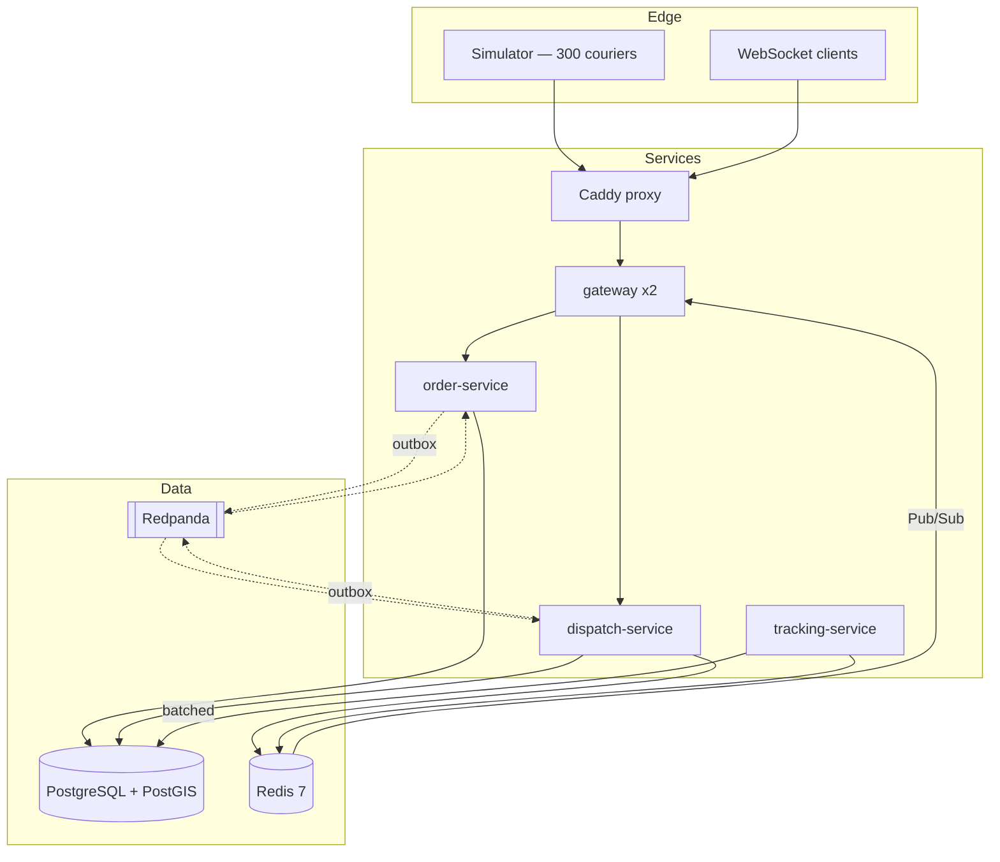

# Wassal — real-time courier dispatch

**A dispatch engine built to prove six correctness invariants under concurrency and failure —
with measured evidence, not claims.**

```bash
git clone https://github.com/Achraf-Rejouan/wassal && cd wassal
./wassal.sh start     # full stack + 300 simulated couriers, healthy in ~35s
./wassal.sh demo      # watch every claim below being made, live
./wassal.sh chaos     # kill real containers, measure recovery
```

---

## Measured

Every number is produced by a command in this repository, on the hardware named below. **Targets
that were missed or restated are in the table too** — a published miss is what makes the passes
believable.

| Property | Target | **Measured** | How |
|---|---|---|---|
| No double-assignment under contention | 0 violations | **0**, across 5 000 concurrent accepts on 50 couriers, with contention *asserted to have occurred* | `AtomicClaimIT` |
| One assignment per order | exactly 1 | **1**, from 40 couriers racing the same order | `AtomicClaimIT` |
| Idempotent accept | exactly 1 | **1** assignment from 500 *parallel* replays | `AtomicClaimIT` |
| Expiry accuracy across process death | ±1 s | **0.134 s** past deadline, after a kill spanning t+2 s → t+10 s of a 15 s offer | live stack |
| Recovery after killing a service | < 30 s, 0 lost | **6.1 s**, 0 orders lost, all invariants held | `./wassal.sh chaos` |
| Location write amplification | ≥ 10× | **481×** fewer write statements than positions | live stack |
| Courier response calibration | 60% accept | **59%** | live stack |
| Cold clone → healthy stack | < 2 min | **~35 s**, 12 containers | `./wassal.sh start` |
| Assignment latency p99 | < 500 ms | **not formally measured** — see *What is missing* | — |

<sub>Fedora 44, native Docker (no VM), 15.4 GB host, 8-core. Full stack ≈1.9 GB resident.</sub>

---

## The six invariants

| | Invariant | Enforced by |
|---|---|---|
| **INV-1** | A courier has at most one active assignment | Partial unique index — **structural** |
| **INV-2** | An order has at most one active assignment | Partial unique index — **structural** |
| **INV-3** | An accepted offer produces exactly one assignment, however many times delivered | Unique constraint + inbox dedup |
| **INV-4** | Every order reaches a terminal state, including across restarts | Durable deadline + sweeper + gauge |
| **INV-5** | Every transition emits its event exactly once after dedup | Transactional outbox |
| **INV-6** | A released courier returns to the pool exactly once | Conditional release in one transaction |

**Four of six cannot be violated by a bug in the service** — the write simply fails:

```sql
CREATE UNIQUE INDEX uq_active_assignment_per_courier
    ON dispatch.assignments (courier_id) WHERE status = 'ACTIVE';
```

That converts INV-1 from *"enforced by code we tested"* into *"enforced by a constraint that
cannot be bypassed"*. The chaos suite proves it by inserting **directly into the table**,
bypassing every application guard — and the database refuses.

INV-4 and INV-5 are properties of a process over *time* rather than of a row, so no constraint
can hold them. They carry the heaviest test and observability burden instead.

---

## The interesting decision

**[ADR-0004](docs/decision-log.md): the atomic claim uses a Postgres conditional update, not a
Redis distributed lock.** Sprint 2 benchmarked the rejected option rather than just arguing
about it:

| | Per attempt |
|---|---|
| Redis `SET NX PX` | **0.093 ms** |
| Postgres conditional `UPDATE` | **0.940 ms** |

**Redis is ~10× faster and the decision stands**, because throughput was never the reason. The
crash window is:

```
Redis lock                                   Postgres conditional update
-----------------------------------------    -----------------------------------------
1. SET lock:courier:X NX PX 30000  -> OK      1. BEGIN
2. <<< PROCESS DIES >>>                       2. UPDATE couriers SET status='BUSY'
   Lock survives. Courier is claimed,            WHERE id=X AND status='AVAILABLE'
   no assignment exists, and nothing in       3. INSERT assignment
   Postgres records the attempt.              4. <<< PROCESS DIES >>>
3. Released only when the TTL expires.           Rollback. Courier AVAILABLE again.
                                                 No orphan, no TTL, no cleanup job.
```

The lock's TTL has no correct value: it must exceed the longest possible assignment *and* be
short enough that a crash does not strand a courier. Those constraints do not both have a
solution — which is Kleppmann's fencing-token argument reduced to this specific claim. Both
halves are asserted in `RedisLockComparisonTest`.

The organising principle that follows: **the index may lie; the claim cannot.** Redis holds
fast, rebuildable, possibly-stale views. Postgres decides. A stale index costs one wasted offer
attempt, never one incorrect assignment.

---

## A bug the tests caught

**24 concurrent requests sharing one idempotency key created 24 orders.**

`OrderCreationService` inserted the order, *then* claimed the idempotency key, and returned
early when the claim lost. But returning normally **commits** — a transaction only rolls back
on a throw. So every loser committed the order it had already inserted.

The transaction was correct. The *order of writes inside it* was not, and atomicity does not
help with ordering. Fixed by claiming the key first, so a loser has written nothing.

**A mocked repository would have hidden it completely** — which is why no infrastructure is
mocked anywhere in this project, enforced by an ArchUnit rule rather than by discipline.

Sixteen more are in **[`docs/bug-log.md`](docs/bug-log.md)**, generated from structured commit
trailers with a CI check that fails if the log goes stale. Three were found only by killing
containers or running two gateway instances — including Caddy holding a stale upstream IP after
a restart, returning 502 while both gateways were healthy and reachable directly.

---

## Why it looks over-engineered

It is deliberate, and the reasoning is written down rather than implied.

This is a portfolio project whose objective function is **demonstrated engineering depth, not
delivered features**. A version that shipped the same features more simply would be a *failed*
outcome here ([ADR-0001](docs/decision-log.md)). A modular monolith with an advisory lock would
deliver every feature in a quarter of the time — and would remove the conditions under which
four of the five target properties are even observable. An in-process call cannot arrive twice,
out of order, or after the caller died.

Every boundary had to pass one test: *name the failure it isolates or the scaling axis it
unlocks.* The audit is in [`docs/architecture-review.md`](docs/architecture-review.md), and it
found that **more distribution would make this system worse** — splitting courier state from
assignment state would move the atomic claim across a network boundary and force the very
distributed lock ADR-0004 rejects.

**Feature scope is deliberately thin.** No payments, ratings, chat, admin screens, mobile apps
or authentication. Those are non-goals, not unfinished work.

---

## Architecture



**Two gateway instances run by default**, not only in tests — cross-instance WebSocket fan-out
is the design's headline capability, and one instance would leave it visible only inside a test
nobody runs. The proof connects to each instance's own port, bypassing the proxy, so a pass
cannot be an artefact of both ends landing on the same process.

Java 21 · Spring Boot 3 · PostgreSQL 16 + PostGIS · Redis 7 · Redpanda · Docker Compose ·
Testcontainers · Toxiproxy · Prometheus / Grafana.

---

## Running it

```bash
./wassal.sh start              # full stack + simulator + observability
./wassal.sh start --minimal    # no simulator, no observability
./wassal.sh status             # health, endpoints, live invariant counters
./wassal.sh demo               # scripted walkthrough
./wassal.sh proof              # every test suite
./wassal.sh chaos              # kill containers, measure recovery
./wassal.sh stop               # keep data     ./wassal.sh down   # delete everything
```

Grafana (anonymous, read-only): <http://localhost:3000/d/wassal-evidence>

---

## What is missing

Stated plainly. The project's committed scope is `v0.4.0`
([ADR-0010](docs/decision-log.md)); these are outside it.

- **No sustained-load report.** NFR-001's p99 < 500 ms is a *target*, not a measurement.
  Latency figures come from the contention harness, which is the more adversarial condition but
  not the specified one. **NFR-001 is not formally measured.**
- **Three-source reconciliation is not built.** System state is validated against ground truth
  emitted independently by the simulator — a component sharing no code, schema or connection
  with the services under test. The fuller comparison against Kafka consumed from offset 0 is
  specified in [`docs/architecture-review.md`](docs/architecture-review.md) finding F-2 and is
  not implemented. **The non-circularity claim holds, at reduced strength.**
- **NFR-003 was ambiguous and is restated.** "10× lower write rate" is unachievable in *rows* —
  nothing is discarded, so every position eventually lands. What batching reduces is write
  *statements*, which is what write amplification actually costs. Measured at 481×.
- **NFR-011's 3 GB `core` sub-target was missed** and recorded as missed rather than quietly
  moved.
- **No authentication.** Identity is asserted, not verified — deliberate ([`docs/07-security.md`](docs/07-security.md)),
  with the blast radius and the containment written down.
- **Chaos runs manually**, not in CI, because it needs the live stack.

---

## Documentation

The full engineering blueprint — written *before* the code — is in [`docs/`](docs/). It
includes the parts that did not survive contact: a Blocker found in self-review, a scope reset
that moved the finish line, and a partial dissent from an external review.

| Document | Contains |
|---|---|
| [`PROJECT_CONTEXT.md`](PROJECT_CONTEXT.md) | Start here — the whole project in one read |
| [`docs/decision-log.md`](docs/decision-log.md) | 11 ADRs, append-only, including the benchmarked one |
| [`docs/03-prd.md`](docs/03-prd.md) | Requirements, the six invariants, traceability matrix |
| [`docs/04-architecture.md`](docs/04-architecture.md) | Components, latency budget, degraded modes |
| [`docs/architecture-review.md`](docs/architecture-review.md) | Self-review that found a Blocker before any code |
| [`docs/testing-strategy.md`](docs/testing-strategy.md) | Why the suites are shaped this way, and their limits |
| [`docs/07-security.md`](docs/07-security.md) | Two threat models — one of them is self-deception |
| [`docs/bug-log.md`](docs/bug-log.md) | 17 real bugs, generated from commit trailers |
| [`docs/09-review-report.md`](docs/09-review-report.md) | Engineering review + every autonomous decision, with reversal cost |

**The self-review is worth more than the architecture document.** It found that the
reconciliation job as designed compared Postgres against Postgres — it would have passed,
reported zero variance, gone in this README, and proven nothing.

## Licence

MIT
