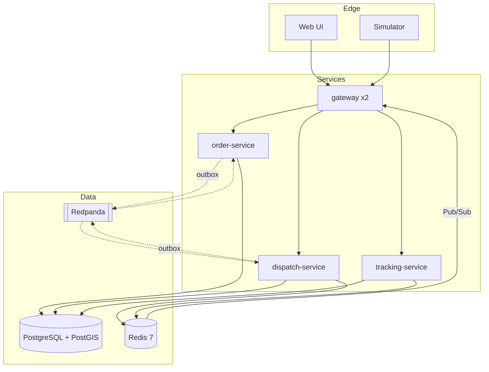

# Wassal — real-time courier dispatch

**A dispatch engine built to prove six correctness invariants under concurrency and failure —
with measured evidence, not claims.**

> **Status: Sprint 1 of 5 — walking skeleton.** The numbers below are *targets*, not
> measurements. They will be replaced with measured results (including any that miss) at
> `v0.4.0`. This notice is removed only when the numbers are real.

---

## What this proves

An order arrives. The system finds nearby available couriers, offers the job with a bounded
15-second deadline, and assigns on acceptance. Declines and timeouts pass the offer onward.
Cancellation after acceptance returns the order to the pool through a compensating saga.

The delivery domain is the vehicle. **The deliverable is the evidence** that these hold:

| | Invariant | Enforced by |
|---|---|---|
| **INV-1** | A courier has at most one active assignment at any instant | Partial unique index — *structural* |
| **INV-2** | An order has at most one active assignment at any instant | Partial unique index — *structural* |
| **INV-3** | An accepted offer produces exactly one assignment, however many times the accept is delivered | Unique constraint + inbox dedup |
| **INV-4** | Every order reaches a terminal state, including across restarts | Durable deadline + sweeper |
| **INV-5** | Every state transition emits its domain event exactly once after dedup | Transactional outbox |
| **INV-6** | A courier released by cancellation or expiry returns to the pool exactly once | Conditional release in one transaction |

Four of the six are enforced by database constraints rather than application code — **a bug in
a service cannot violate them, because the write simply fails.**

## Targets (not yet measured)

| Property | Target | Status |
|---|---|---|
| Assignment latency, order → first offer | p99 < 500 ms | not measured |
| Invariant violations under contention | 0, with contention proven to have occurred | not measured |
| Offer expiry accuracy across a service restart | ±1 s | not measured |
| Recovery to consistency after killing `dispatch-service` | < 30 s, zero lost orders | not measured |
| Location ingest | 100 msg/s with Postgres writes ≥10× lower | not measured |
| Cold clone → running | one command, < 2 min | not measured |

## Why it looks over-engineered

It is deliberate, and the reasoning is written down rather than implied.

This is a portfolio and skills-development project. Its objective function is **demonstrated
engineering depth, not delivered features** — a version that ships the same features more
simply would be a failed outcome here, not a win. See
[ADR-0001](docs/decision-log.md#adr-0001-architectural-depth-is-the-deliverable-complexity-is-deliberate).

Every service boundary and every async boundary had to pass one test: *name the failure it
isolates or the scaling axis it unlocks.* Anything that could not was merged or cut — that
audit is in [`docs/architecture-review.md`](docs/architecture-review.md).

**Feature scope is deliberately thin.** There are no payments, ratings, chat, admin screens or
mobile apps, and there is no authentication. Those are non-goals, not unfinished work.

## Architecture



**The organising principle:** *the index may lie; the claim cannot.* Redis holds fast,
rebuildable, possibly-stale views. Postgres holds the truth and is the only thing permitted to
decide an assignment. A stale index costs one retry, never one incident.

Java 21 · Spring Boot 3 · PostgreSQL 16 + PostGIS · Redis 7 · Redpanda · Docker Compose ·
Testcontainers · Toxiproxy · OpenTelemetry / Prometheus / Grafana.

## Running it

```bash
docker compose up          # core profile — services, Postgres, Redis, Redpanda
./gradlew build            # build + unit tests
./gradlew integrationTest  # Testcontainers suite (real Postgres, Redis, Redpanda)
```

## Documentation

The full engineering blueprint is in [`docs/`](docs/). Start with
[`PROJECT_CONTEXT.md`](PROJECT_CONTEXT.md).

| Document | Contains |
|---|---|
| [`docs/decision-log.md`](docs/decision-log.md) | 11 ADRs — every decision that would be painful to undo |
| [`docs/03-prd.md`](docs/03-prd.md) | Requirements, the six invariants, traceability matrix |
| [`docs/04-architecture.md`](docs/04-architecture.md) | Components, flows, latency budget, failure recovery |
| [`docs/05-data-model.md`](docs/05-data-model.md) | Schema, access patterns, full DDL |
| [`docs/08-delivery-plan.md`](docs/08-delivery-plan.md) | Five sprints, calendar, scope reconciliation |
| [`docs/bug-log.md`](docs/bug-log.md) | Generated from commit trailers — real bugs the suites caught |

**The most interesting decision is
[ADR-0004](docs/decision-log.md#adr-0004-atomic-claim-in-postgres-not-a-distributed-lock):**
why the atomic claim uses a Postgres conditional update and partial unique indexes rather than
a Redis distributed lock — and the crash window that decided it.

## Licence

MIT
