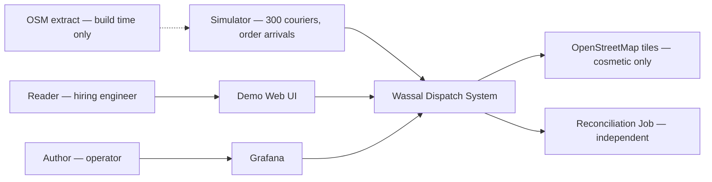
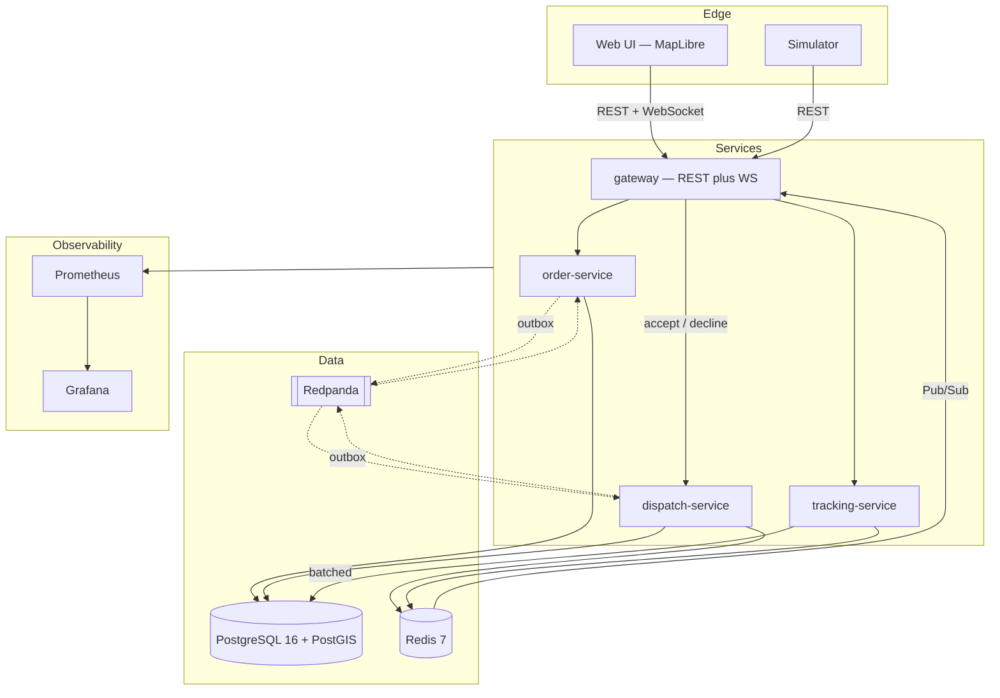
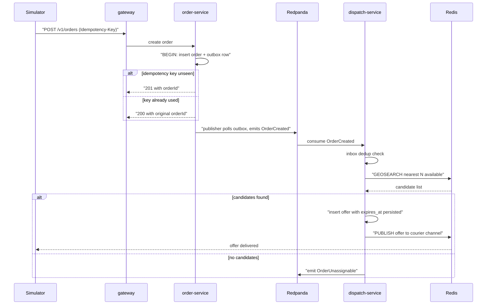
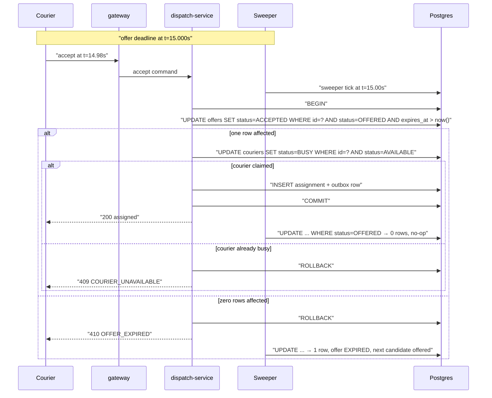
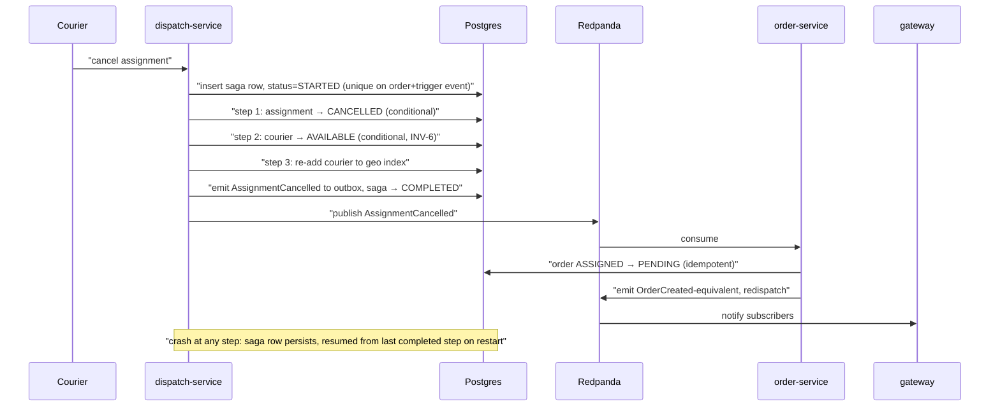
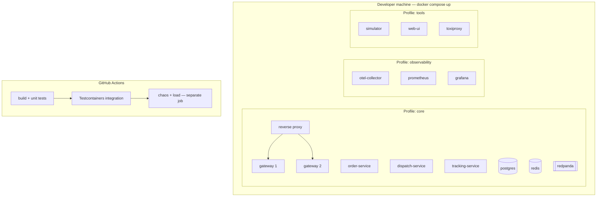
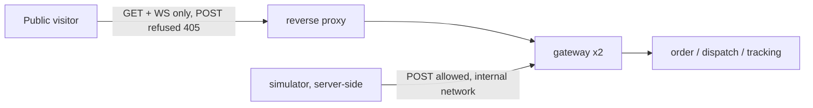

# Architecture

**Phase:** 5 · **Date:** 2026-08-08

> ADR reasoning lives in `docs/decision-log.md`. This document references ADR IDs and does
> not restate rationale, so there is exactly one editable copy of each argument.

---

## Overview

Wassal is an event-driven system of four services plus a standalone simulator, over
PostgreSQL/PostGIS, Redis and Kafka. Orders enter through a gateway and are persisted with
their domain event in one transaction; a transactional outbox carries that event to Kafka,
where the dispatch service picks it up, finds nearby couriers via a Redis geospatial index,
and issues a time-bounded offer whose deadline lives in the database rather than in a
process. Acceptance atomically claims courier and order together in a single Postgres
transaction backed by partial unique indexes. Location updates flow on a separate hot path
that never touches Postgres synchronously, fanning out to WebSocket clients through Redis
Pub/Sub.

**The one constraint that drove the shape:** ADR-0001 — demonstrated engineering depth is
the objective function, so async boundaries are kept wherever they isolate a real failure,
and Phase 6 removes any that do not.

**The organising principle worth stating up front**, because it recurs in five different
decisions below: *the index may lie; the claim cannot.* Redis holds fast, approximate,
rebuildable views — who is nearby, where someone was last seen, who is subscribed. Postgres
holds the truth and is the only thing permitted to decide an assignment. Every place those
two disagree, the resolution is the same: the fast path proposes, the transactional path
disposes, and a stale proposal costs one retry rather than one incident.

---

## Architecture Style

**Chosen:** Event-driven microservices — four deployable services and a standalone
simulator, communicating through Kafka for domain events and Redis Pub/Sub for ephemeral
real-time data, over a shared-nothing-per-service data model with PostgreSQL as the single
authoritative store.

**Because:** this is the one project where the standard advice is inverted, and it is worth
being explicit about that rather than quietly departing from it.

The Project Forge default is a modular monolith with a managed relational database, moving
away from it only where a specific NFR forces the move. That default is correct for almost
every project, and it would be correct here if user-facing outcomes were the objective —
a single Spring Boot application with a Postgres advisory lock and server-sent events would
deliver every feature in this PRD in roughly a quarter of the time.

It is rejected because the objective function is different (ADR-0001, ADR-0002). The
project exists to produce evidence of five properties, and a monolith removes the conditions
under which four of them are even observable: an in-process call cannot arrive twice, cannot
arrive out of order, and cannot arrive after the caller has died. **The distribution is not
overhead in service of features; it is the subject matter.**

That said, the default is not abandoned wholesale. Its discipline is retained in two forms:

1. **Every boundary must justify itself** by naming the failure it isolates or the scaling
   axis it unlocks. Phase 6 applies that test explicitly to all five services and every
   Kafka topic, and merges what fails it.
2. **Module boundaries inside each service are real**, so the option to collapse services
   later remains cheap — the same option value the monolith default is protecting.

**Reconsider when:** the honest signals that would invalidate this choice —

- *The project's purpose changes to serving real users.* Then the ADR-0001 inversion no
  longer applies and the correct move is to collapse to a modular monolith, keeping only the
  location hot path separate.
- *Operating the stack consumes more than ~15% of development hours.* Measured, not
  estimated. At that point the operational tax is eating the learning budget it was meant to
  buy.
- *Cold start exceeds 2 minutes or the stack exceeds 6 GB* (NFR-007, NFR-011). Both are
  early warnings that the container count has outgrown its usefulness.

---

## System Context

The system has no runtime third-party dependencies — every external arrow below is either
build-time or purely cosmetic. That is unusual and it is what makes one-command local
operation achievable.

*Notice:* the simulator is an actor, not a component of the system under test, and the
reconciliation job hangs off the side rather than inside — both deliberate, so that
validation is never self-referential (FR-020, FR-017).

---

## Components

Every component serves at least one requirement. "Serves" lists FR and NFR IDs.

| Component | Responsibility | Tech | Serves | Scaling |
|---|---|---|---|---|
| **gateway** | REST ingress, WebSocket termination, subscription registry, asserted-identity resolution, record-scoped authorization | Spring Boot 3, Spring WebFlux for WS | FR-001, FR-003, FR-016, FR-022, NFR-006 | Horizontal — the axis the Redis Pub/Sub layer exists to unlock. **Two instances run by default in the `core` profile** behind a reverse proxy (review F-7), so the demo itself exercises cross-instance fan-out rather than only the test suite |
| **order-service** | Order aggregate, state machine, order-side outbox, idempotent creation | Spring Boot 3, Postgres | FR-001, FR-002, FR-003, FR-004, FR-013 | Horizontal, stateless. Bounded by Postgres writes |
| **dispatch-service** | Candidate search, the `available` courier set, offer lifecycle, expiry sweeper, atomic claim, assignment, cancellation saga orchestration | Spring Boot 3, Postgres, Redis | FR-006, FR-007, FR-008, FR-009, FR-011, FR-012, FR-021 | Horizontal — sweeper and claim are both multi-instance safe by conditional claim, deliberately without leader election |
| **tracking-service** | Location ingest hot path, batched cold path, geo index of **all** courier positions, position fan-out publication | Spring Boot 3, Redis, Postgres | FR-010, FR-016, NFR-003 | Horizontal and independent — isolates a 100 msg/s write path from the correctness path |
| **simulator** | 300 couriers on a road graph, calibrated response behaviour, Poisson arrivals, ground-truth emission, stress profile | Spring Boot 3 standalone, seeded RNG | FR-018, FR-019, FR-020, FR-021, NFR-008 | Vertical only — one instance, deliberately, because determinism requires a single RNG stream |
| **reconciliation-job** | Three-way comparison across **independent** sources: Postgres live state, Kafka topics consumed from offset 0, and the simulator ground-truth sink (review F-2) | Spring Boot 3 batch, own queries, no shared domain code | FR-017, FR-020 | Runs on demand |
| **web-ui** | Single-screen live map | React + MapLibre GL | FR-022 | Static assets |
| **postgres** | Authoritative state, event log, outbox, inbox, saga state, partitioned location history | PostgreSQL 16 + PostGIS | All correctness FRs | Vertical. Single instance — no HA, by decision |
| **redis** | Geo index (tracking-owned), `available` set (dispatch-owned), hot positions, Pub/Sub fan-out, offer-delivery channels | Redis 7 | FR-006, FR-010, FR-016 | Single instance. All contents rebuildable |
| **redpanda** | Domain event backbone | Redpanda (Kafka API) | FR-013, FR-014, INV-5 | Single broker locally |
| **otel / prometheus / grafana** | Traces, metrics, invariant counters, dashboards | OTel Collector, Prometheus, Grafana | FR-015, FR-023, NFR-010 | Single instance |

**The simulator scales vertically on purpose.** Determinism (NFR-008) requires one RNG
stream; two instances would produce a non-reproducible interleaving, and reproducibility is
a stated requirement rather than a convenience. Worth recording, because "make it
horizontally scalable" is the reflex and it would be wrong here.

---

## Component Diagram

*Notice:* dotted arrows are asynchronous. The only path from `tracking-service` to
`gateway` is through Redis Pub/Sub, never direct — that indirection is what makes gateway
instances interchangeable and is the whole point of FR-016.

---

## Module Boundaries

Boundaries erode unless written down. Each service's internals follow the same three-layer
shape (`api` → `domain` → `infra`), and the rules below are enforced by ArchUnit tests
rather than convention (NFR-009).

| Module | Owns | Exposes | Must never reach into |
|---|---|---|---|
| **gateway** | WebSocket sessions, subscription registry, HTTP contract, identity assertion | REST + WS to clients | Any service's database. Gateway holds **no** domain state and owns no tables — it is a pure edge |
| **order-service** | `orders`, order state machine, order outbox | `OrderCreated`, `OrderPickedUp`, `OrderDelivered`, `OrderCancelled`, `OrderUnassignable` events; a read API for status | `offers`, `assignments`, `couriers`. It may not decide dispatch outcomes |
| **dispatch-service** | `offers`, `assignments`, `couriers.status`, the Redis `available` set, saga state, sweeper | `OfferCreated`, `OfferAccepted/Declined/Expired`, `AssignmentCreated`, `AssignmentCancelled` | `orders` table directly — it reacts to order events and requests transitions through events, never by writing another aggregate's rows |
| **tracking-service** | `location_history`, the Redis geo index of **all** courier positions, hot position keys | `CourierLocationUpdated` on Redis Pub/Sub (not Kafka — see ADR-0007) | `offers`, `assignments`. It knows nothing about dispatch |
| **simulator** | Its own RNG state, road graph, ground-truth sink | Nothing consumed by the system | Any service database. It is a **client**, and reaching into a table would destroy the independence that makes FR-020 meaningful |
| **reconciliation-job** | Nothing | A three-source variance report | Any service's *domain code*. It reads raw tables and the raw event log through its own queries. Enforced by ArchUnit (FR-017) |

Two of these rules do real work and are worth calling out:

**`dispatch-service` may not write `orders`.** It would be one line and it would collapse
the aggregate boundary, making INV-2 a convention rather than a constraint. Dispatch emits
events; order-service owns its own transitions.

**`reconciliation-job` may not import domain code.** This is the difference between a proof
and a tautology (risk R-9). A reconciliation job that reuses the repository layer validates
that the code agrees with itself.

### Geospatial ownership — corrected by review F-3

The first draft had `tracking-service` maintaining an index of *available* couriers, which
would have required it to know courier availability — state owned by `dispatch-service`,
which the boundary rules above forbid it from reading. The split that resolves it:

| Redis structure | Owner | Contents |
|---|---|---|
| `geo:couriers` | **tracking-service** | Position of **every** courier, regardless of status |
| `set:available` | **dispatch-service** | IDs of couriers currently `AVAILABLE` |

Candidate search is `GEOSEARCH` over `geo:couriers` **intersected with** `set:available`. At
N=300 the intersection is trivial, and the ownership becomes clean: **tracking owns *where*,
dispatch owns *who is free*.** Neither service reads the other's schema or its Redis keys for
writing. The correctness property from ADR-0003 is unaffected — both structures are
advisory, and the Postgres claim remains authoritative.

### Shared database, separate schemas

All services share one PostgreSQL instance with **one schema per service** and no
cross-schema foreign keys. This is a deliberate middle position, and it has a cost worth
stating plainly: it is not true database-per-service, so it does not prove that the services
could be independently deployed against separate stores.

It is chosen anyway because the alternative — four Postgres containers — buys isolation the
project does not need while spending memory the project does need (NFR-011), and because the
atomic claim (ADR-0004) requires courier status and assignment insert to share a
transaction. Cross-schema FKs are forbidden so that the logical boundary stays real, and
referential integrity across services is maintained by events plus reconciliation rather
than by the database. Recorded as a known limitation in Phase 6.

---

## Data Flow

### Flow 1 — Order to first offer

The latency-critical path (NFR-001) and the one with the most participants.

**Latency budget decomposition**, which is what makes the 500 ms p99 target defensible
rather than hopeful:

| Step | Budget (p99) | Note |
|---|---|---|
| HTTP ingress + order insert + outbox write | 40 ms | One transaction, two inserts |
| Outbox publisher poll interval | **100 ms** | The largest single contributor — ADR-0006's accepted cost |
| Kafka produce → consume | 40 ms | Single broker, single partition per key |
| Inbox dedup lookup | 10 ms | Primary-key hit |
| `GEOSEARCH` over 300 couriers | 10 ms | In-memory, N=300 |
| Offer insert + publish | 40 ms | |
| Delivery to courier client | 40 ms | Redis Pub/Sub → gateway → WS |
| **Sum** | **280 ms** | |
| Headroom to target | **220 ms** | Absorbs GC pauses, contention, retry of one lost candidate |

The budget has ~44% headroom, concentrated where it is needed: the retry path when a
candidate's claim fails and the next candidate is taken. If measurement shows the target
missed, the first lever is the outbox poll interval (100 → 25 ms), which trades empty
queries for latency, and the second is CDC (ADR-0006's deferred option).

### Flow 2 — Accept versus expire, the race

The subtlest flow in the system (FR-012) and the one most worth diagramming, because the
correctness argument is entirely in the `alt` branches.

*Notice:* there is no coordination between the accept path and the sweeper — no lock, no
leader, no distributed agreement. Both issue the same conditional update, Postgres serialises
them on the row, and the loser observes zero affected rows. **The `expires_at > now()`
predicate is inside the accept's `WHERE` clause, not merely a trigger for the sweeper** —
that is what makes expiry authoritative (A-07) even when the accept arrives at the database
first. Removing that one predicate silently changes the system's semantics, which is why it
carries a named test.

### Flow 3 — Cancellation saga with compensation

*Notice:* steps 1–3 are one Postgres transaction, so the courier release and the assignment
cancellation cannot diverge. Only the cross-service part (order return to pool) is genuinely
asynchronous, and it is idempotent. **The saga is smaller than it first appears** — most of
what looks like distributed compensation is local and transactional, and being honest about
that is more useful than drawing four network hops to look sophisticated.

---

## Communication

| From | To | Mechanism | Sync? | Failure handling |
|---|---|---|---|---|
| Client / simulator | gateway | REST over HTTP | Sync | Idempotency keys on all mutations; `409`/`410` are definite answers, never retried blindly |
| Client | gateway | WebSocket | Async | Reconnect with resubscribe; current state sent on resubscribe, no replay (FR-016) |
| gateway | order-service, dispatch-service, tracking-service | REST, internal | Sync | Timeout 2 s, fail closed (NFR-012). No retry on non-idempotent commands |
| order-service | Kafka | Transactional outbox + polling publisher | Async | At-least-once; consumer dedup makes it effectively-once (FR-014) |
| dispatch-service | Kafka | Transactional outbox + polling publisher | Async | Same |
| Kafka | dispatch-service, order-service | Consumer groups, manual offset commit after effect | Async | Offset committed only after the effect is durable; redelivery on crash absorbed by inbox dedup |
| tracking-service | gateway | **Redis Pub/Sub, not Kafka** | Async | At-most-once, deliberately (ADR-0007). Loss of one position is invisible; the next arrives in ~3 s |
| dispatch-service | Redis | `GEOSEARCH` + `SMEMBERS` intersect, `SADD`/`SREM` on `set:available` | Sync | Both structures are rebuildable caches. On failure, fail closed on claim; never assign unverified |
| **Decline → next candidate** | **in-process** | Direct method call inside `dispatch-service` | Sync | **No Kafka round trip on the re-offer control path** (review F-8). Dispatch owns the offer aggregate, so re-offering is local. Kafka carries the *notification* of the outcome, not the control flow — this is what makes FR-007's 200 ms re-offer budget achievable against a 100 ms publisher poll |
| Sweeper | Postgres | Conditional `UPDATE … FOR UPDATE SKIP LOCKED`, **batch 500, adaptive on lag** | Sync | Multi-instance safe without leader election. Batch raised from 100 by review F-4 — see below |

### Kafka topics — every one justified

Applying the ADR-0001 test: name the failure it isolates or the scaling axis it unlocks.
Topics that fail it are cut in Phase 6.

| Topic | Key | Partitions | Carries | Failure it isolates |
|---|---|---|---|---|
| `order.lifecycle` | `orderId` | 3 | `OrderCreated`, `OrderPickedUp`, `OrderDelivered`, `OrderCancelled`, `OrderUnassignable` | **Order acceptance from dispatch availability.** If dispatch-service is down, orders are still accepted and are dispatched on recovery. This is precisely the failure the chaos suite induces to prove INV-4 — the topic is load-bearing, not decorative |
| `assignment.lifecycle` | `orderId` | 3 | `OfferCreated`, `OfferAccepted/Declined/Expired`, `AssignmentCreated`, `AssignmentCancelled` | **Assignment decisions from downstream consumers** — order state updates and client notification proceed independently of dispatch throughput, and replay reconstructs assignment history for reconciliation |

Keyed by `orderId` so all events for one order land on one partition and stay ordered.
Ordering **across** orders is explicitly not guaranteed and no consumer may assume it.

**Two topics, not seven.** Position updates deliberately do not go to Kafka (ADR-0007), and
there is no `courier.lifecycle` topic because no consumer outside `dispatch-service` needs
courier state — a topic whose only consumer is its own producer is decoration by definition.

---

## Throughput and Resource Sizing

Added by review Phase 6. The architecture originally stated mechanisms without stating their
throughput, which hid two bottlenecks reachable at the *design target* rather than at some
future scale.

### Sweeper capacity (review F-4)

| Parameter | Original | Revised | Reason |
|---|---|---|---|
| Tick interval | 250 ms | 250 ms | Unchanged — gives 4× headroom on ±1 s |
| Batch size | 100 | **500, adaptive** | 100 per tick caps expiry at **400/s**. The stress profile deliberately creates mass simultaneous expiry; at 1 000 concurrent expiries the sweep took 2.5 s and **breached NFR-004** |
| Adaptive rule | — | Double the batch (to a 2 000 ceiling) while `sweeper_lag_seconds > 0.25`, halve while below | Absorbs stress bursts without paying for large batches in steady state |
| Alert threshold | — | **0.5 s** | Deliberately *below* the 1 s requirement, so the alert fires before the SLO breaks rather than simultaneously with it |

### Connection pools (review F-5)

`dispatch-service` runs three competing workloads against one pool: claim traffic (latency
critical), the 250 ms sweeper, and the 100 ms outbox publisher. At a default HikariCP size of
10, background work starves the claim path under stress — and it presents as **latency, not
error**, which is the hardest kind of bottleneck to attribute.

| Service | Main pool | Dedicated pools | Rationale |
|---|---|---|---|
| `dispatch-service` | 16 | sweeper **4**, publisher **4** | Background work cannot starve claims; each has a guaranteed floor |
| `order-service` | 12 | publisher **4** | |
| `tracking-service` | 8 | cold-path flusher **4** | Flush batches are long-running and must not block ingest |
| `gateway` (each) | 4 | — | Holds no domain state; only proxies |

Total ≈ 56 connections against Postgres `max_connections = 100`, leaving headroom for the
reconciliation job and manual inspection. `hikari_connections_pending > 0` sustained for 30 s
is the trigger metric.

---

## Technology Decisions

| ADR | Decision | Status |
|---|---|---|
| ADR-0001 | Architectural depth is the deliverable; complexity is deliberate | Accepted |
| ADR-0002 | Event-driven microservices over the modular-monolith default | Accepted |
| ADR-0003 | Redis GEO for the candidate index, PostGIS for history — hybrid with explicit ownership | Accepted |
| ADR-0004 | Atomic claim in Postgres, not a distributed lock | Accepted |
| ADR-0005 | Durable expiry via persisted deadline plus sweeper, not delayed messaging | Accepted |
| ADR-0006 | Polling outbox publisher; CDC deferred with a documented migration path | Accepted |
| ADR-0007 | Redis Pub/Sub for position fan-out; Kafka for domain events | Accepted |
| ADR-0008 | Orchestrated saga with persisted state, not choreography | Accepted |

Hosting is deliberately not pre-empted here; it is decided in Phase 10 with its own ADR.

---

## Deployment

Local Docker Compose is the canonical deployment (C-3). No staging tier (A-06).

*Notice:* three Compose profiles, and **two gateway instances behind a reverse proxy in
`core`** (review F-7) — so a plain `docker compose up` exercises cross-instance WebSocket
fan-out rather than leaving the design's headline capability visible only inside a test.

### Memory budget (review F-6)

NFR-011's 6 GB target is **not achievable with default settings** — six JVMs at default heap
plus Redpanda's default memory reservation exceed it before Postgres is counted. Explicit
limits are therefore a requirement, not a tuning nicety. Every container carries a Compose
`mem_limit`.

| Container | Limit | Setting |
|---|---:|---|
| gateway × 2 | 2 × 384 MB | `-XX:MaxRAMPercentage=50` |
| order-service | 384 MB | same |
| dispatch-service | 512 MB | same — largest working set (sweeper, saga, claim) |
| tracking-service | 448 MB | same — cold-path flush buffers |
| simulator | 512 MB | same — 300 courier states plus the road graph |
| postgres | 768 MB | `shared_buffers=256MB` |
| redis | 256 MB | `maxmemory 200mb`, `maxmemory-policy noeviction` — eviction would silently corrupt the geo index |
| redpanda | 1 024 MB | `--memory 1G --overprovisioned --smp 1` — the default reservation is the single largest offender |
| reverse proxy | 32 MB | |
| **`core` profile total** | **≈ 4.7 GB** | Against the 3 GB `core` target — **misses it** |
| otel + prometheus + grafana | ~900 MB | |
| **full stack total** | **≈ 5.6 GB** | Against the 6 GB target — **holds, with ~7% headroom** |

Two honest notes. First, `core` at 4.7 GB **misses NFR-011's 3 GB sub-target**; the 3 GB
figure was set before the two-gateway change and before Redpanda was sized. Rather than
quietly restating the target, it is recorded as a miss and revisited in Phase 13 — the
plausible fix is a `minimal` profile without the simulator and second gateway, which would
land near 3.2 GB. Second, `noeviction` on Redis is deliberate: under memory pressure the
correct behaviour is to fail loudly, because an evicted geo entry is an invisible correctness
degradation of exactly the kind this project exists to catch.

**Startup ordering** is by health check with `depends_on: condition: service_healthy`, never
by `sleep`. Postgres and Redis must be healthy before services start; Redpanda must have
created topics before consumers connect. A `docker compose up` that requires a second
attempt fails NFR-007 and is treated as a defect.

**CI/CD.** Push to `main` triggers build, unit tests, and the Testcontainers integration
suite. Chaos and load suites run in a separate, slower job that is allowed to take time and
never allowed to be skipped (risk R-4). A scheduled weekly job performs a **cold-clone test**
— fresh checkout, `docker compose up`, assert all health checks green within 2 minutes —
which is the only mechanism that actually enforces NFR-007.

### Hardening required by Phase 9

Three configuration rules, enforced by a CI check on the hosted overlay rather than by
memory — Phase 9 rated misconfiguration (OWASP A05) the highest-*likelihood* risk in the
system, and all three are one Compose line away from being wrong.

| # | Rule | Threat |
|---|---|---|
| **A-3** | `management.endpoints.web.exposure.include=health,prometheus` and nothing else. `/actuator/env`, `/heapdump` and `/threaddump` stay closed; `/actuator/prometheus` is reachable only from the observability network | Config and memory disclosure (T-03) |
| **A-4** | The **hosted overlay publishes only the reverse proxy's 443.** No `ports:` entry on Postgres, Redis, Redpanda or any service. A CI check greps the hosted overlay and fails on any infra `ports:` declaration | An internet-reachable unauthenticated Redis is a trivially exploited target (T-02) — the single highest-impact hosted threat |
| **A-6** | **Exhibition mode** for the hosted profile — see below | Total identity spoofing (T-01) |

### Exhibition mode (hosted profile only)

Because identity is asserted rather than verified (A-03), a public deployment with writes
enabled is trivially compromisable by anyone with `curl`: any visitor can impersonate any
courier, accept offers, or cancel assignments. Rather than defend that surface, the hosted
profile **removes it**.

| Aspect | Local profile | Hosted profile (exhibition mode) |
|---|---|---|
| Mutating endpoints (`POST`) | Open | **Refused at the proxy** — `405` |
| Read endpoints (`GET`) | Open | Open |
| WebSocket stream | Open | Open |
| Who drives state | The simulator, run by the developer | The simulator, **run server-side** inside the deployment |
| Grafana | Full | Anonymous read-only viewer |

The visitor watches an autonomous simulation rather than participating in it. This costs
nothing, removes T-01, T-05 and T-14 simultaneously, and is arguably a *better* demo — a
visitor cannot disturb the running demonstration, so what a reader sees is always the system
under its designed load rather than whatever the last visitor did to it.

#### Where the refusal happens — and why it matters (review R-01)

**Mutations are refused at the reverse proxy, never inside the gateway.** This placement is
load-bearing, and getting it wrong breaks the demo in a way that is invisible until someone
visits.

The server-side simulator is what generates all load in exhibition mode, and it drives the
system through exactly the endpoints exhibition mode refuses — `POST /couriers/{id}/location`,
`POST /offers/{id}/accept`, `POST /orders`. It reaches the gateway **directly on the Compose
network at `http://gateway:8080`**, bypassing the proxy entirely.

Had the refusal been implemented in the gateway itself, the simulator would have been blocked
along with the public, and the hosted demo would show a permanently empty map — a live site
that looks broken, which is worse for a Reader than no site at all.

**Enforced by a CI check:** the simulator's base URL in `docker-compose.hosted.yml` must be
the internal service name, never the public hostname.

**Rollback** is `git revert` plus recreate. There is no production traffic and no data worth
preserving, which makes deployment risk genuinely near-zero — one of the few places where
this project is simpler than a real one, and worth saying so rather than inventing a
blue-green story for a system nobody depends on.

---

## Scalability

| Dimension | Current design ceiling | First bottleneck | Next move |
|---|---|---|---|
| Order arrival rate | ~500/min | Outbox publisher poll batch size and Postgres write throughput | Increase batch size; reduce poll interval; then CDC (ADR-0006) |
| Available couriers in geo index | ~100 k | Redis `GEOSEARCH` is O(N+log M); at 300 it is not remotely the constraint | Shard the index by geohash prefix |
| Location ingest | ~5 k msg/s | Redis single-threaded command throughput, well beyond the 100 msg/s target | Redis Cluster, or partition by courier ID hash |
| Location history writes | ~50 k rows/s batched | Postgres insert throughput on a partitioned table | Larger batches; then `COPY`; then a time-series store |
| WebSocket connections | ~10 k per gateway instance | File descriptors and heap per session | Horizontal gateway scaling — already supported, which is why the Pub/Sub layer exists |
| Concurrent assignment attempts | ~2 k/s | Row-level lock contention on `couriers` under the stress profile | This is the interesting ceiling: it is contention-bound, not throughput-bound. Sharding does not help; the next move is optimistic retry with jitter |

The last row is the honest one. Every other ceiling is two orders of magnitude above the
target. **The only dimension where this system is genuinely near a limit is contention on
hot couriers** — which is exactly the dimension the project exists to explore, and exactly
what the stress profile (FR-021) is built to induce.

---

## Reliability

**Availability target: none.** Cost of downtime is genuinely zero (Phase 2). This is stated
as a decision rather than an omission, because it is what licenses the single-instance
Postgres, single-broker Redpanda and absent backups. The project's reliability claim is
about **recovery**, not uptime — a distinction that is frequently conflated and is central
to what this system demonstrates.

**SLOs that do exist**, because they are testable properties rather than availability
promises:

| SLO | Target | Source |
|---|---|---|
| Assignment latency | p99 < 500 ms | NFR-001 |
| Offer expiry accuracy | ±1 s, **alert at 0.5 s** | NFR-004 |
| Recovery to consistency after a kill | < 30 s | NFR-005 |
| Invariant violations | 0 | INV-1…INV-6 |

### Expected in-flight inconsistency (review F-9)

A legitimate window exists between `dispatch-service` committing `AssignmentCreated` and
`order-service` consuming it: during it, an assignment exists for an order still marked
`OFFERING`. This is correct eventual consistency, bounded by the publisher poll plus consume
latency (~150 ms p99), and no design change is warranted.

It is recorded because **the reconciliation job must classify it as in-flight rather than as
variance.** Without that distinction the job reports false positives on every live run, and a
proof artifact that cries wolf is quickly ignored — which would waste the Blocker fix in
F-2. Reconciliation therefore takes a consistent snapshot and reports in-flight items in a
separate section from genuine variance.

### Degraded modes

What still works when each dependency is down — the table that matters most for the chaos
suite, since it defines what "correct behaviour under failure" means.

| Dependency down | Still works | Stops working | Correctness preserved? |
|---|---|---|---|
| **Redis** | Order creation, order status queries, delivery completion | Candidate search, location ingest, live map, offer delivery | **Yes** — dispatch fails closed. No assignment is made without a verified claim (NFR-012). Positions are dropped and counted; the geo index rebuilds from Postgres on recovery |
| **Kafka / Redpanda** | Everything synchronous: order creation, accepts, claims, location | Dispatch of new orders; cross-service propagation | **Yes** — outbox accumulates and drains on recovery. Nothing is lost; latency degrades. Outbox depth is a gauge with an alert |
| **Postgres** | Nothing meaningful | Everything | **Yes, trivially** — the system fails closed and entirely. Correct, if unavailable |
| **dispatch-service** | Order creation and acceptance into the pool; location tracking | Offers, assignments, expiry | **Yes** — the headline chaos scenario. Orders queue in Kafka; the sweeper resumes on restart and expires anything overdue. NFR-005's 30 s applies here |
| **tracking-service** | Orders, offers, assignments — the whole correctness path | Position updates, live map, geo index freshness | **Yes**, degrading gracefully: candidate search uses last-known positions, which grow stale. **This is the one genuinely dangerous degradation** — stale positions produce poor candidates, not incorrect ones, so it fails quietly. Position age is exported as a gauge specifically to make it loud |
| **gateway (one of two)** | Everything, via the other instance | Sockets on the dead instance | **Yes** — clients reconnect and resubscribe; current state is sent on resubscribe |

The `tracking-service` row deserves emphasis. Every other failure is loud. This one silently
degrades match quality while the system continues to report success — the class of failure
that is hardest to detect and most worth instrumenting, which is why position staleness gets
its own metric rather than being inferred.

---

## Failure Recovery

| Failure | Detection | Blast radius | Recovery | RTO | RPO |
|---|---|---|---|---|---|
| dispatch-service killed mid-assignment | Health check; Kafka consumer-group rebalance | New assignments halt; in-flight transaction rolls back | Restart; sweeper expires overdue offers; unconsumed events redelivered from last committed offset | **< 30 s** (NFR-005) | **0** — the transaction either committed or did not |
| **order-service killed mid-creation** (review F-1) | Health check; gateway `503` | Order creation halts; in-flight transaction rolls back | Restart. An order either exists with its outbox row or does not exist at all — no half-created state is reachable | < 20 s | **0** |
| dispatch-service killed *between* Postgres commit and Kafka publish | Outbox row remains unsent | One event delayed | Publisher republishes on restart; consumers dedup (FR-014) | < 5 s | **0** |
| Sweeper falls behind | `sweeper_lag_seconds` gauge exceeds threshold | Offers expire late; NFR-004 breached | Scale sweeper batch; investigate lock contention | Minutes | 0 |
| tracking-service killed with a partial batch buffered | Flush-loss counter increments | One flush window of *history* lost | Restart. Hot path unaffected — last-known positions live in Redis | < 10 s | **≤ 1 flush window** (accepted and documented, FR-010) |
| Redis lost entirely | Connection failures; geo-index size gauge drops to zero | Candidate search and live map stop; dispatch fails closed | Restart; rebuild geo index from `couriers` + last-known positions in Postgres | < 60 s | **Hot positions lost** — accepted; they are a cache, not a ledger |
| Kafka lost entirely | Producer errors; outbox depth gauge climbs | Dispatch of new orders stops | Restart; outbox drains in order | < 2 min | **0** — the outbox is the durability boundary |
| Postgres lost entirely | Everything fails | Total | Restart; **no backup** — data is regenerable from a seeded run | < 2 min | **Total, by decision** |
| gateway instance lost | Client disconnect | Sockets on that instance | Client reconnects and resubscribes; current state resent | < 5 s | 0 — no replay by design |
| Poison message in a consumer | Consumer error rate; DLQ depth | One partition stalls if not handled | Retry with backoff, then route to DLQ after 3 attempts and continue | < 30 s | 0 |
| Split brain between Redis index and Postgres truth | Reconciliation variance report | Stale candidates offered; claims fail and the next candidate is taken | Self-healing — a failed claim removes the stale entry. Periodic full rebuild as a backstop | Continuous | 0 |

The last row is the design paying off. **A stale geo index cannot cause an incorrect
assignment**, only a wasted offer attempt, because the claim is authoritative and the index
is advisory. That property is what "the index may lie; the claim cannot" buys, and it is
worth more than any amount of effort spent keeping the two perfectly synchronised.

---

## Reconciliation Design (review F-2)

The Phase 6 review found the original reconciliation design to be **partly self-referential**
— a Blocker, because it would have passed, reported zero variance, appeared in the README,
and proven nothing.

**The flaw:** the outbox row and the state change are written in the same transaction
(FR-013). They therefore *cannot* disagree. Comparing Postgres state against the Postgres
event log is close to a tautology — it verifies that a transaction was atomic, which the
database already guarantees.

**The fix — three independent sources, and what each pairing actually proves:**

| # | Source | Read via | Independence |
|---|---|---|---|
| S1 | Postgres live state (`orders`, `offers`, `assignments`, `couriers`) | The job's own SQL, no domain code | Authoritative present |
| S2 | Kafka topics, consumed from **offset 0** in a dedicated consumer group | Independent consumer, no service code | What was actually *published* — crosses the outbox boundary |
| S3 | Simulator ground-truth sink (FR-020) | Separate sink, written by the simulator | What was *intended*, produced by a component that is not under test |

| Comparison | Proves | Would have been missed before |
|---|---|---|
| S1 ↔ S2 | The outbox publisher worked: every committed transition was published, exactly once after dedup. **This is the real test of INV-5** | Yes — the original design never crossed the publish boundary |
| S1 ↔ S3 | The system did what was asked: every accepted offer in ground truth has exactly one assignment, and vice versa, with no unmatched records either way | Yes |
| S2 ↔ S3 | Event history reconstructs the run independently of live state — catches a state table that drifted from its own history | Yes |
| S1 ↔ outbox table | Transaction atomicity | No — near-tautological, retained only as a cheap sanity check |

The job must be able to **fail**: a deliberately corrupted row is injected in the test suite
and reconciliation is asserted to detect it (FR-017). A reconciliation job never observed
reporting non-zero variance is untested code, the same argument that applies to the invariant
counters in FR-015.
