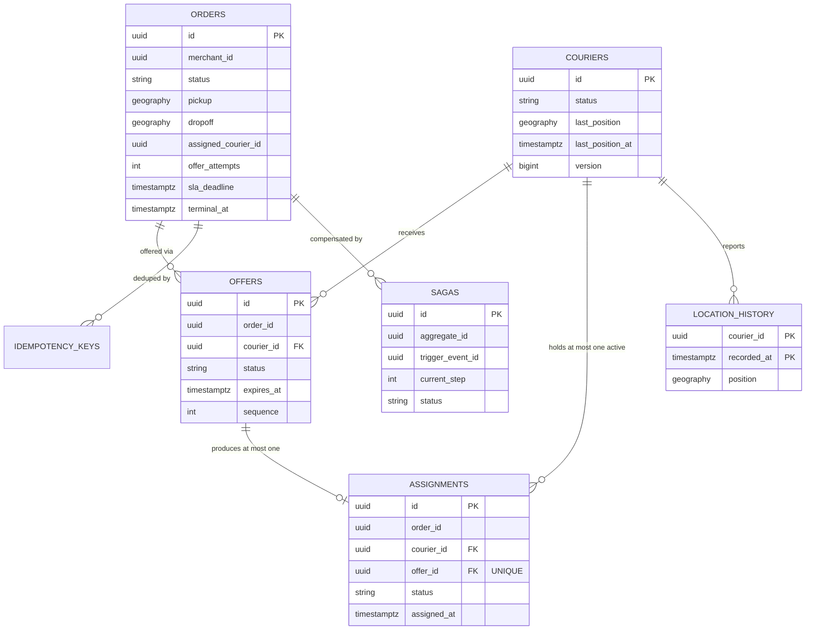
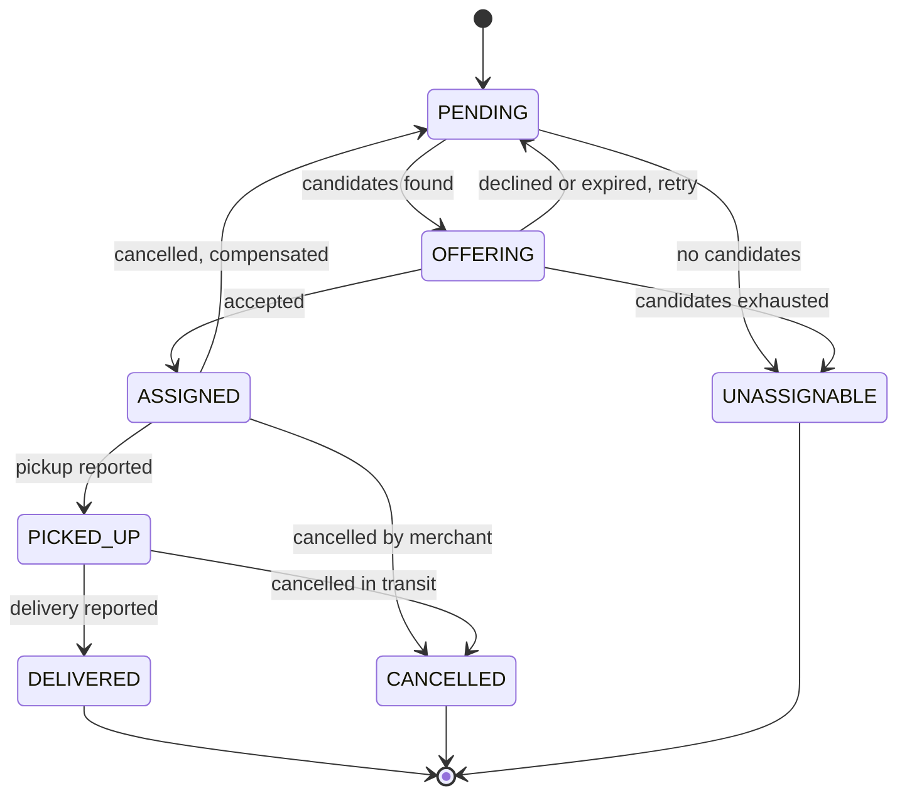
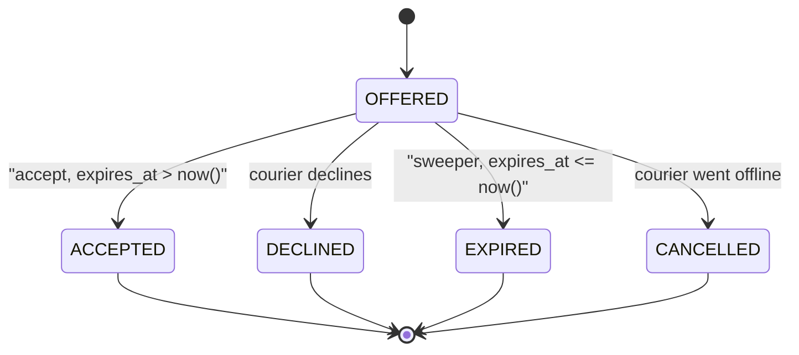

# Data Model

**Phase:** 7 · **Date:** 2026-08-08
**Built on:** `04-architecture.md` as amended by the Phase 6 review (F-2, F-3, F-5 applied).

> Designed from access patterns, not from nouns. Every index below traces to a numbered
> query; any index that does not is deleted.

---

## Storage Choices

| Store | Technology | Holds | Why |
|---|---|---|---|
| **Postgres — `orders` schema** | PostgreSQL 16 | `orders`, `order_outbox`, `idempotency_keys` | Authoritative order state. Owned by `order-service` |
| **Postgres — `dispatch` schema** | PostgreSQL 16 | `couriers`, `offers`, `assignments`, `sagas`, `dispatch_outbox`, `processed_messages` | Authoritative claim state. Owned by `dispatch-service`. **The atomic claim requires `couriers` and `assignments` to share a transaction** (ADR-0004), which is why they share a schema |
| **Postgres — `tracking` schema** | PostgreSQL 16 + PostGIS | `location_history` (partitioned) | Durable position history and spatial analysis. Owned by `tracking-service` |
| **Redis — `geo:couriers`** | Redis 7 GEO | Position of every courier | Write-mostly index at 100 msg/s. Owned by `tracking-service` (F-3) |
| **Redis — `set:available`** | Redis 7 SET | IDs of `AVAILABLE` couriers | Owned by `dispatch-service` (F-3) |
| **Redis — `hot:pos:{courierId}`** | Redis 7 HASH | Last known position + timestamp | Read by order status (FR-003) and the map |
| **Redis — Pub/Sub channels** | Redis 7 | Position fan-out, offer delivery | Ephemeral, at-most-once by design (ADR-0007) |
| **Kafka topics** | Redpanda | `order.lifecycle`, `assignment.lifecycle` | The event log that reconciliation reads independently (F-2) |
| **Ground-truth sink** | JSONL files on a mounted volume | Simulator intent | **Deliberately not a database** — see note below |

**Why the ground-truth sink is a flat file.** It could be a Postgres table, and that would be
more convenient. It is a file precisely *because* it is less convenient: writing it to the
same database the system under test writes to creates an opportunity for the two to become
entangled, and the whole value of FR-020 rests on independence. A JSONL file on a volume,
written by a process that shares no schema and no connection with the services, cannot be
accidentally coupled. Convenience is the wrong optimisation target for a proof artifact.

**No cross-schema foreign keys.** `assignments.order_id` references an order in another
schema and carries **no FK constraint** — referential integrity across service boundaries is
maintained by events plus reconciliation, not by the database. This is the cost of the
schema-per-service decision (ADR-0002) and it is deliberate: an FK there would make the
logical boundary fictional.

---

## Entities

### `orders.orders`

**Represents:** one delivery request from pickup to dropoff.
**Lifecycle:** created by `order-service` on `POST /v1/orders`; mutated by its own state
machine in response to consumed assignment events; never deleted.

| Field | Type | Null? | Default | Constraints | Notes |
|---|---|---|---|---|---|
| `id` | `uuid` | no | `gen_random_uuid()` | PK | |
| `merchant_id` | `uuid` | no | — | — | Asserted identity (A-03), not verified |
| `status` | `order_status` | no | `'PENDING'` | enum | See state machine below |
| `pickup` | `geography(Point,4326)` | no | — | — | PostGIS |
| `dropoff` | `geography(Point,4326)` | no | — | — | |
| `pickup_address` | `text` | yes | — | — | Display only |
| `dropoff_address` | `text` | yes | — | — | |
| `assigned_courier_id` | `uuid` | yes | — | — | **Denormalised** from `assignments`; see note |
| `offer_attempts` | `int` | no | `0` | `>= 0` | Drives candidate exhaustion → `UNASSIGNABLE` |
| `version` | `bigint` | no | `0` | — | Optimistic locking |
| `created_at` | `timestamptz` | no | `now()` | — | |
| `updated_at` | `timestamptz` | no | `now()` | — | Trigger-maintained |
| `terminal_at` | `timestamptz` | yes | — | — | Set on reaching a terminal state; makes INV-4 queryable |
| `sla_deadline` | `timestamptz` | no | — | — | `created_at + interval '15 minutes'`. INV-4 is defined against this |

`assigned_courier_id` is denormalised deliberately. It serves query Q-3 (order status with
courier position), which is the demo's hot read, and avoids a cross-schema join that the
boundary rules forbid anyway. It is **not authoritative** — `assignments` is — and
reconciliation checks the two agree. A denormalisation that nothing verifies is a liability;
this one is verified.

`terminal_at` exists so INV-4 is a cheap indexed query rather than a scan: *"orders where
`terminal_at IS NULL` and `sla_deadline < now()`"* is the stuck-order gauge.

### `orders.idempotency_keys`

**Represents:** a client's deduplication token for order creation (FR-001).
**Lifecycle:** inserted on first use; pruned after the retention window.

| Field | Type | Null? | Default | Constraints | Notes |
|---|---|---|---|---|---|
| `key` | `text` | no | — | **PK** | Client-supplied |
| `merchant_id` | `uuid` | no | — | — | Scopes the key; two merchants may reuse a string |
| `request_hash` | `text` | no | — | — | SHA-256 of the canonical request body |
| `order_id` | `uuid` | no | — | FK → `orders(id)` | The result to replay |
| `created_at` | `timestamptz` | no | `now()` | — | |

PK is `(merchant_id, key)`. **The unique constraint is the concurrency mechanism** — two
simultaneous requests with the same key both attempt the insert, one wins, the loser catches
the violation and reads the winner's `order_id`. Never check-then-act.

### `dispatch.couriers`

**Represents:** a courier and, critically, their availability — the contended resource.
**Lifecycle:** seeded by the simulator; status mutated by availability toggles, claims,
releases; never deleted.

| Field | Type | Null? | Default | Constraints | Notes |
|---|---|---|---|---|---|
| `id` | `uuid` | no | `gen_random_uuid()` | PK | |
| `display_name` | `text` | no | — | — | Synthetic |
| `status` | `courier_status` | no | `'OFFLINE'` | enum: `OFFLINE`/`AVAILABLE`/`BUSY` | **The contended column.** ADR-0004's conditional update targets it |
| `last_position` | `geography(Point,4326)` | yes | — | — | Cold copy for geo-index rebuild after a Redis loss |
| `last_position_at` | `timestamptz` | yes | — | — | Staleness detection |
| `version` | `bigint` | no | `0` | — | Optimistic locking |
| `created_at` | `timestamptz` | no | `now()` | — | |
| `updated_at` | `timestamptz` | no | `now()` | — | |

`last_position` duplicates Redis `hot:pos:*` on purpose. It is written on the **cold path**
(batched, ~1 write per courier per flush window), not on every report, so it costs nothing
against NFR-003 — and without it, a Redis loss would leave the geo index unrebuildable and
dispatch permanently dead. It is the recovery path for the failure-recovery table's "Redis
lost entirely" row.

### `dispatch.offers`

**Represents:** a time-bounded proposal of one order to one courier. The most correctness-
critical table in the system.

| Field | Type | Null? | Default | Constraints | Notes |
|---|---|---|---|---|---|
| `id` | `uuid` | no | `gen_random_uuid()` | PK | |
| `order_id` | `uuid` | no | — | no FK (cross-schema) | |
| `courier_id` | `uuid` | no | — | FK → `couriers(id)` | Same schema, so FK is legitimate |
| `status` | `offer_status` | no | `'OFFERED'` | enum: `OFFERED`/`ACCEPTED`/`DECLINED`/`EXPIRED`/`CANCELLED` | |
| `expires_at` | `timestamptz` | no | — | — | **The durable deadline (ADR-0005).** Also the accept predicate (FR-012) |
| `offered_at` | `timestamptz` | no | `now()` | — | |
| `responded_at` | `timestamptz` | yes | — | — | |
| `sequence` | `int` | no | — | `>= 1` | Nth offer for this order; drives exhaustion |
| `created_at` | `timestamptz` | no | `now()` | — | |

**`expires_at` is the single most important column in the schema.** It makes the deadline
durable across process death (INV-4) *and* available as a SQL predicate in the accept path,
which is what makes the accept-vs-expire race resolvable without coordination (FR-012). A
design that put the deadline in a timer, a Redis key or a scheduler would lose the second
property even if it kept the first.

### `dispatch.assignments`

**Represents:** a courier committed to an order. The table INV-1 and INV-2 are enforced on.

| Field | Type | Null? | Default | Constraints | Notes |
|---|---|---|---|---|---|
| `id` | `uuid` | no | `gen_random_uuid()` | PK | |
| `order_id` | `uuid` | no | — | no FK (cross-schema) | |
| `courier_id` | `uuid` | no | — | FK → `couriers(id)` | |
| `offer_id` | `uuid` | no | — | FK → `offers(id)`, **UNIQUE** | Enforces INV-3 structurally |
| `status` | `assignment_status` | no | `'ACTIVE'` | enum: `ACTIVE`/`COMPLETED`/`CANCELLED` | |
| `assigned_at` | `timestamptz` | no | `now()` | — | |
| `picked_up_at` | `timestamptz` | yes | — | — | |
| `completed_at` | `timestamptz` | yes | — | — | |
| `cancelled_at` | `timestamptz` | yes | — | — | |
| `cancel_reason` | `text` | yes | — | — | |

Three constraints on this table carry four invariants, and they are the reason the invariants
are structural rather than conventional:

```sql
CREATE UNIQUE INDEX uq_active_assignment_per_courier
    ON dispatch.assignments (courier_id) WHERE status = 'ACTIVE';   -- INV-1
CREATE UNIQUE INDEX uq_active_assignment_per_order
    ON dispatch.assignments (order_id)   WHERE status = 'ACTIVE';   -- INV-2
ALTER TABLE dispatch.assignments
    ADD CONSTRAINT uq_assignment_per_offer UNIQUE (offer_id);       -- INV-3
```

The third is worth dwelling on. `UNIQUE (offer_id)` — unconditional, not partial — means one
offer can produce one assignment **ever**, including across cancellation and re-acceptance.
That is stronger than INV-3 strictly requires, and it is chosen deliberately: a cancelled
assignment must lead to a *new offer* rather than a revived one, so the stronger constraint
matches the intended domain semantics and closes a re-acceptance path that would otherwise
need application logic to forbid.

### `dispatch.sagas`

**Represents:** the persisted progress of a compensating workflow (ADR-0008).

| Field | Type | Null? | Default | Constraints | Notes |
|---|---|---|---|---|---|
| `id` | `uuid` | no | `gen_random_uuid()` | PK | |
| `saga_type` | `text` | no | — | — | `CANCELLATION` for v1 |
| `aggregate_id` | `uuid` | no | — | — | The order |
| `trigger_event_id` | `uuid` | no | — | — | The event that started it |
| `current_step` | `int` | no | `0` | `>= 0` | **Resumption point after a crash** |
| `status` | `saga_status` | no | `'STARTED'` | enum: `STARTED`/`COMPLETED`/`FAILED_NEEDS_ATTENTION` | |
| `attempts` | `int` | no | `0` | — | Backoff and give-up |
| `last_error` | `text` | yes | — | — | |
| `created_at` / `updated_at` | `timestamptz` | no | `now()` | — | |

`UNIQUE (aggregate_id, saga_type, trigger_event_id)` — a duplicated trigger event cannot
start two sagas. This is FR-009's idempotency expressed as a constraint rather than as code.

### `*.{order,dispatch}_outbox`

**Represents:** a domain event committed atomically with its state change (FR-013).
**Column shape is constrained by ADR-0006** to match Debezium's outbox-event-router SMT, so
switching to CDC later needs no schema migration.

| Field | Type | Null? | Default | Constraints | Notes |
|---|---|---|---|---|---|
| `id` | `uuid` | no | `gen_random_uuid()` | PK | Becomes the Kafka message key for dedup |
| `aggregate_type` | `text` | no | — | — | Debezium router: routes to topic |
| `aggregate_id` | `uuid` | no | — | — | Debezium router: becomes the partition key |
| `event_type` | `text` | no | — | — | Debezium router: header |
| `payload` | `jsonb` | no | — | — | Debezium router: message body |
| `created_at` | `timestamptz` | no | `now()` | — | Ordering within an aggregate |
| `sent_at` | `timestamptz` | yes | — | — | `NULL` = pending. **Marked only after broker ack** |
| `attempts` | `int` | no | `0` | — | |

### `dispatch.processed_messages` (inbox)

**Represents:** consumer-side dedup state converting at-least-once into effectively-once
(FR-014, INV-3, INV-5).

| Field | Type | Null? | Default | Constraints | Notes |
|---|---|---|---|---|---|
| `message_id` | `uuid` | no | — | **PK** | The producing outbox row's `id` |
| `consumer_group` | `text` | no | — | PK component | Same message, different consumers |
| `processed_at` | `timestamptz` | no | `now()` | — | |

PK is `(message_id, consumer_group)`. **The row is inserted in the same transaction as the
effect** — which makes "dedup record exists but effect did not commit" an unreachable state
rather than a case to handle. Concurrent duplicates race on the PK; one commits, the other
catches the violation and no-ops.

**Retention is a correctness constraint, not housekeeping.** The window must exceed *Kafka
retention (24 h) + maximum retry duration*, or a replayed message could outlive its dedup
record and be processed twice. Set to **72 h**, with a startup assertion that
`dedup_retention > kafka_retention + max_retry_duration` — a config error here is silent and
would surface as a mysterious duplicate weeks later.

### `tracking.location_history`

**Represents:** the append-only cold path (FR-010). Partitioned by day, 7-day retention
(A-05).

| Field | Type | Null? | Default | Constraints | Notes |
|---|---|---|---|---|---|
| `courier_id` | `uuid` | no | — | PK component | |
| `recorded_at` | `timestamptz` | no | — | PK component, **partition key** | Client-supplied |
| `position` | `geography(Point,4326)` | no | — | — | |
| `speed_kmh` | `real` | yes | — | — | |
| `ingested_at` | `timestamptz` | no | `now()` | — | Ingest lag = `ingested_at - recorded_at` |

PK `(courier_id, recorded_at)` gives duplicate suppression for free — a retried position
report violates the PK and is discarded (FR-010's idempotency edge case). No surrogate key,
because it would permit exactly the duplicates the table is supposed to reject.

**No index beyond the PK.** This table is written at ~100 rows/s batched and read only by
reconciliation and occasional spatial analysis, both of which tolerate a partition scan. A
GiST index on `position` would cost write throughput on the system's highest-volume table to
serve queries with no latency budget — the classic unjustified index, and it is deliberately
absent.

---

## Relationships

| From | To | Cardinality | On delete | Notes |
|---|---|---|---|---|
| `orders` → `offers` | logical | 1 : N | no cascade | Cross-schema, no FK |
| `offers` → `assignments` | `offer_id` | 1 : 0..1 | `RESTRICT` | UNIQUE — enforces INV-3 |
| `couriers` → `offers` | `courier_id` | 1 : N | `RESTRICT` | Same schema |
| `couriers` → `assignments` | `courier_id` | 1 : N, **≤ 1 active** | `RESTRICT` | Partial unique — INV-1 |
| `orders` → `assignments` | logical | 1 : N, **≤ 1 active** | no FK | Partial unique — INV-2 |
| `orders` → `idempotency_keys` | `order_id` | 1 : N | `RESTRICT` | |
| `couriers` → `location_history` | logical | 1 : N | no FK | FK on a partitioned high-volume table costs writes for integrity nothing depends on |

`RESTRICT` everywhere, never `CASCADE`. Nothing in this system is deleted (see Data
Lifecycle), so a cascade could only ever fire by accident — and a cascade that fires by
accident on `assignments` would silently destroy the evidence the project exists to produce.

---

## ERD



*Notice:* `OFFERS ||--o| ASSIGNMENTS` — at most one, enforced by a unique constraint rather
than by convention. Most of this system's correctness is visible in the cardinalities.

---

## Record Lifecycles



*Notice:* `ASSIGNED → PENDING` is the compensating transition and the only backward edge in
the machine. It is what makes INV-6 non-trivial — the courier must be released exactly once
on that edge, and the edge can be traversed repeatedly for the same order.



*Notice:* `ACCEPTED` and `EXPIRED` are both reachable only from `OFFERED`, by conditional
updates whose predicates are mutually exclusive on `expires_at`. That mutual exclusivity is
the entire proof of FR-012 — there is no state from which both transitions can succeed.

---

## Access Patterns

Derived from the PRD before any index was written.

| # | Query | Frequency | Entities | Filter / sort | Latency budget |
|---|---|---|---|---|---|
| Q-1 | Find nearest N available couriers | ~2.5/s, 7.5/s peak | Redis `geo:couriers` ∩ `set:available` | Radius, distance asc | **50 ms** (NFR-002) |
| Q-2 | Claim courier + insert assignment | ~0.8/s, **2 000/s under stress** | `couriers`, `assignments`, `offers` | By PK, conditional | **50 ms** |
| Q-3 | Order status with courier position | ~5/s | `orders` + Redis `hot:pos` | By PK | 100 ms (FR-003) |
| Q-4 | **Sweep expired offers** | **4/s per instance** | `offers` | `status='OFFERED' AND expires_at <= now()`, sorted, `LIMIT 500` | **50 ms** — must not exceed the 250 ms tick |
| Q-5 | Poll unsent outbox | **10/s per service** | `*_outbox` | `sent_at IS NULL`, sorted `(aggregate_id, created_at)`, `LIMIT 100` | **20 ms** — mostly returns nothing |
| Q-6 | Dedup check on consume | ~5/s | `processed_messages` | By PK | 5 ms |
| Q-7 | Idempotency lookup on create | ~1/s | `idempotency_keys` | By PK | 5 ms |
| Q-8 | Candidates already offered this order | ~2.5/s | `offers` | `order_id`, all statuses | 20 ms |
| Q-9 | **Stuck-order gauge (INV-4)** | 1 per 30 s | `orders` | `terminal_at IS NULL AND sla_deadline < now()` | 500 ms |
| Q-10 | Resume in-flight sagas on startup | 1 per boot | `sagas` | `status='STARTED'` | 1 s |
| Q-11 | Reconciliation full scan | 1 per run | all | Full table scans by design | Minutes — no budget |
| Q-12 | Courier's active assignment | ~1/s | `assignments` | `courier_id AND status='ACTIVE'` | 20 ms |
| Q-13 | Batch insert positions (cold path) | ~0.2/s, 500 rows each | `location_history` | Insert only | 200 ms |
| Q-14 | Prune sent outbox rows | 1 per 5 min | `*_outbox` | `sent_at < now() - 1h` | 5 s |
| Q-15 | Prune expired dedup rows | 1 per hour | `processed_messages` | `processed_at < now() - 72h` | 5 s |

**Q-4 and Q-5 are the highest-frequency queries in the system**, at 4/s and 10/s per
instance, and both mostly return nothing. That is the cost of polling (ADR-0005, ADR-0006),
accepted knowingly — and it is why both get dedicated connection pools (review F-5) and
tight partial indexes.

---

## Indexes

Every index traces to a numbered pattern. Anything unjustified is omitted, and two
tempting-but-absent indexes are recorded at the end.

| Table | Columns | Type | Serves | Rationale |
|---|---|---|---|---|
| `orders` | `(id)` | PK btree | Q-3 | |
| `orders` | `(sla_deadline) WHERE terminal_at IS NULL` | **partial** btree | **Q-9** | Only non-terminal orders can be stuck; the partial predicate keeps the index tiny — most rows are terminal |
| `orders` | `(status) WHERE status = 'PENDING'` | partial btree | redispatch scan | Same reasoning |
| `idempotency_keys` | `(merchant_id, key)` | PK btree | Q-7 | Also the concurrency mechanism |
| `couriers` | `(id)` | PK btree | Q-2 | |
| `couriers` | `(status) WHERE status = 'AVAILABLE'` | partial btree | geo-index rebuild | Only ever queried for available couriers |
| `offers` | `(id)` | PK btree | accept path | |
| `offers` | `(expires_at) WHERE status = 'OFFERED'` | **partial** btree | **Q-4** | **The most important index in the system.** Only outstanding offers can expire, so the index holds only live rows — typically dozens, not millions. Without the partial predicate this index would grow forever and the sweeper would degrade over a run |
| `offers` | `(order_id, sequence)` | btree | Q-8 | Exclude already-offered candidates |
| `assignments` | `(id)` | PK btree | | |
| `assignments` | `(courier_id) WHERE status='ACTIVE'` | **partial unique** | **INV-1**, Q-12 | Constraint first, index second |
| `assignments` | `(order_id) WHERE status='ACTIVE'` | **partial unique** | **INV-2** | |
| `assignments` | `(offer_id)` | unique | **INV-3** | |
| `*_outbox` | `(created_at) WHERE sent_at IS NULL` | **partial** btree | **Q-5** | Pending rows only. The index shrinks back to near-empty as the publisher drains, which is what keeps a 10/s poll cheap |
| `processed_messages` | `(message_id, consumer_group)` | PK btree | Q-6 | |
| `processed_messages` | `(processed_at)` | btree | Q-15 | Pruning only |
| `sagas` | `(status) WHERE status = 'STARTED'` | partial btree | Q-10 | |
| `sagas` | `(aggregate_id, saga_type, trigger_event_id)` | unique | FR-009 idempotency | |
| `location_history` | `(courier_id, recorded_at)` | PK btree, per partition | Q-13 dedup | |

**Five partial indexes, and that concentration is the design's central insight about this
workload.** Every hot query targets a *small live subset* of a table that is mostly history:
outstanding offers among millions of terminated ones, unsent outbox rows among millions of
sent ones, non-terminal orders among mostly-delivered ones. Full indexes on those columns
would grow without bound and slowly degrade the exact paths the latency budgets depend on.
Partial indexes stay proportional to *work in flight* rather than to *work ever done* —
which is a property this system needs specifically because it is designed to run under
sustained synthetic load for long periods.

### Deliberately absent

| Index | Why omitted |
|---|---|
| GiST on `location_history.position` | The highest-volume write table in the system. No query has a latency budget against it (Q-11 is measured in minutes). Would cost write throughput on the exact path NFR-003 constrains |
| btree on `offers.courier_id` | Q-8 filters by `order_id`, not courier. No pattern needs it. Would be added if a "courier's offer history" view ever existed — it does not |
| Any index on `orders.merchant_id` | No access pattern lists it. There is no merchant dashboard (non-goal) |

---

## Schema DDL

```sql
CREATE EXTENSION IF NOT EXISTS postgis;
CREATE EXTENSION IF NOT EXISTS pgcrypto;

CREATE SCHEMA orders;
CREATE SCHEMA dispatch;
CREATE SCHEMA tracking;

-- ---------- enums ----------
CREATE TYPE orders.order_status AS ENUM (
    'PENDING','OFFERING','ASSIGNED','PICKED_UP','DELIVERED','CANCELLED','UNASSIGNABLE');
CREATE TYPE dispatch.courier_status    AS ENUM ('OFFLINE','AVAILABLE','BUSY');
CREATE TYPE dispatch.offer_status      AS ENUM ('OFFERED','ACCEPTED','DECLINED','EXPIRED','CANCELLED');
CREATE TYPE dispatch.assignment_status AS ENUM ('ACTIVE','COMPLETED','CANCELLED');
CREATE TYPE dispatch.saga_status       AS ENUM ('STARTED','COMPLETED','FAILED_NEEDS_ATTENTION');

-- ---------- orders ----------
CREATE TABLE orders.orders (
    id                  uuid PRIMARY KEY DEFAULT gen_random_uuid(),
    merchant_id         uuid NOT NULL,
    status              orders.order_status NOT NULL DEFAULT 'PENDING',
    pickup              geography(Point,4326) NOT NULL,
    dropoff             geography(Point,4326) NOT NULL,
    pickup_address      text,
    dropoff_address     text,
    assigned_courier_id uuid,
    offer_attempts      int NOT NULL DEFAULT 0 CHECK (offer_attempts >= 0),
    version             bigint NOT NULL DEFAULT 0,
    created_at          timestamptz NOT NULL DEFAULT now(),
    updated_at          timestamptz NOT NULL DEFAULT now(),
    terminal_at         timestamptz,
    sla_deadline        timestamptz NOT NULL,
    CONSTRAINT chk_terminal_consistency CHECK (
        (status IN ('DELIVERED','CANCELLED','UNASSIGNABLE')) = (terminal_at IS NOT NULL))
);

CREATE INDEX idx_orders_stuck    ON orders.orders (sla_deadline) WHERE terminal_at IS NULL;
CREATE INDEX idx_orders_pending  ON orders.orders (status)       WHERE status = 'PENDING';

CREATE TABLE orders.idempotency_keys (
    merchant_id  uuid NOT NULL,
    key          text NOT NULL,
    request_hash text NOT NULL,
    order_id     uuid NOT NULL REFERENCES orders.orders(id) ON DELETE RESTRICT,
    created_at   timestamptz NOT NULL DEFAULT now(),
    PRIMARY KEY (merchant_id, key)
);

CREATE TABLE orders.order_outbox (
    id             uuid PRIMARY KEY DEFAULT gen_random_uuid(),
    aggregate_type text NOT NULL,
    aggregate_id   uuid NOT NULL,
    event_type     text NOT NULL,
    payload        jsonb NOT NULL,
    created_at     timestamptz NOT NULL DEFAULT now(),
    sent_at        timestamptz,
    attempts       int NOT NULL DEFAULT 0
);
CREATE INDEX idx_order_outbox_pending
    ON orders.order_outbox (aggregate_id, created_at) WHERE sent_at IS NULL;

-- ---------- dispatch ----------
CREATE TABLE dispatch.couriers (
    id                uuid PRIMARY KEY DEFAULT gen_random_uuid(),
    display_name      text NOT NULL,
    status            dispatch.courier_status NOT NULL DEFAULT 'OFFLINE',
    last_position     geography(Point,4326),
    last_position_at  timestamptz,
    version           bigint NOT NULL DEFAULT 0,
    created_at        timestamptz NOT NULL DEFAULT now(),
    updated_at        timestamptz NOT NULL DEFAULT now(),
    CONSTRAINT chk_available_needs_position CHECK (
        status <> 'AVAILABLE' OR last_position IS NOT NULL)
);
CREATE INDEX idx_couriers_available
    ON dispatch.couriers (status) WHERE status = 'AVAILABLE';

CREATE TABLE dispatch.offers (
    id           uuid PRIMARY KEY DEFAULT gen_random_uuid(),
    order_id     uuid NOT NULL,                       -- no FK: cross-schema
    courier_id   uuid NOT NULL REFERENCES dispatch.couriers(id) ON DELETE RESTRICT,
    status       dispatch.offer_status NOT NULL DEFAULT 'OFFERED',
    expires_at   timestamptz NOT NULL,
    offered_at   timestamptz NOT NULL DEFAULT now(),
    responded_at timestamptz,
    sequence     int NOT NULL CHECK (sequence >= 1),
    created_at   timestamptz NOT NULL DEFAULT now(),
    CONSTRAINT chk_deadline_after_offer CHECK (expires_at > offered_at)
);
CREATE INDEX idx_offers_expiring
    ON dispatch.offers (expires_at) WHERE status = 'OFFERED';
CREATE INDEX idx_offers_by_order ON dispatch.offers (order_id, sequence);

CREATE TABLE dispatch.assignments (
    id            uuid PRIMARY KEY DEFAULT gen_random_uuid(),
    order_id      uuid NOT NULL,                      -- no FK: cross-schema
    courier_id    uuid NOT NULL REFERENCES dispatch.couriers(id) ON DELETE RESTRICT,
    offer_id      uuid NOT NULL REFERENCES dispatch.offers(id)   ON DELETE RESTRICT,
    status        dispatch.assignment_status NOT NULL DEFAULT 'ACTIVE',
    assigned_at   timestamptz NOT NULL DEFAULT now(),
    picked_up_at  timestamptz,
    completed_at  timestamptz,
    cancelled_at  timestamptz,
    cancel_reason text,
    CONSTRAINT uq_assignment_per_offer UNIQUE (offer_id)            -- INV-3
);

CREATE UNIQUE INDEX uq_active_assignment_per_courier                -- INV-1
    ON dispatch.assignments (courier_id) WHERE status = 'ACTIVE';
CREATE UNIQUE INDEX uq_active_assignment_per_order                  -- INV-2
    ON dispatch.assignments (order_id)   WHERE status = 'ACTIVE';

CREATE TABLE dispatch.sagas (
    id               uuid PRIMARY KEY DEFAULT gen_random_uuid(),
    saga_type        text NOT NULL,
    aggregate_id     uuid NOT NULL,
    trigger_event_id uuid NOT NULL,
    current_step     int NOT NULL DEFAULT 0 CHECK (current_step >= 0),
    status           dispatch.saga_status NOT NULL DEFAULT 'STARTED',
    attempts         int NOT NULL DEFAULT 0,
    last_error       text,
    created_at       timestamptz NOT NULL DEFAULT now(),
    updated_at       timestamptz NOT NULL DEFAULT now(),
    CONSTRAINT uq_saga_trigger UNIQUE (aggregate_id, saga_type, trigger_event_id)
);
CREATE INDEX idx_sagas_inflight ON dispatch.sagas (status) WHERE status = 'STARTED';

CREATE TABLE dispatch.dispatch_outbox (LIKE orders.order_outbox INCLUDING ALL);
CREATE INDEX idx_dispatch_outbox_pending
    ON dispatch.dispatch_outbox (aggregate_id, created_at) WHERE sent_at IS NULL;

CREATE TABLE dispatch.processed_messages (
    message_id     uuid NOT NULL,
    consumer_group text NOT NULL,
    processed_at   timestamptz NOT NULL DEFAULT now(),
    PRIMARY KEY (message_id, consumer_group)
);
CREATE INDEX idx_processed_prune ON dispatch.processed_messages (processed_at);

-- ---------- tracking ----------
CREATE TABLE tracking.location_history (
    courier_id  uuid NOT NULL,
    recorded_at timestamptz NOT NULL,
    position    geography(Point,4326) NOT NULL,
    speed_kmh   real,
    ingested_at timestamptz NOT NULL DEFAULT now(),
    PRIMARY KEY (courier_id, recorded_at)
) PARTITION BY RANGE (recorded_at);

-- One partition per day, created ahead by a maintenance job; dropped after 7 days (A-05).
CREATE TABLE tracking.location_history_20260808
    PARTITION OF tracking.location_history
    FOR VALUES FROM ('2026-08-08') TO ('2026-08-09');
```

Two `CHECK` constraints are worth noting because they encode invariants the application would
otherwise have to remember:

- `chk_terminal_consistency` makes `terminal_at IS NOT NULL` **exactly equivalent** to being
  in a terminal state. Q-9's stuck-order gauge depends on that equivalence, and a drift
  between the two would make INV-4 silently unmeasurable — the worst failure class for this
  project.
- `chk_available_needs_position` enforces FR-005's rule that an available courier must have a
  known position. An unlocatable courier in the availability set would be offered work and
  fail every claim.

---

## Multi-tenancy

**None.** Single logical tenant (F-10). `merchant_id` exists on orders as an identity for
authorization scoping (A-03), not as a tenancy discriminator, and no query filters by it. If
tenancy were ever added, `merchant_id` would become the scoping column and every access
pattern above would need revisiting — noted so the absence reads as a decision.

---

## Caching

| What | Where | TTL | Invalidated by | Cost of staleness |
|---|---|---|---|---|
| Courier positions | Redis `geo:couriers` | **None** | Overwritten on next report (~3 s) | **A stale entry yields a wasted offer attempt, never a wrong assignment** — the claim is authoritative (ADR-0003). This is why no TTL is needed |
| Available set | Redis `set:available` | None | `SADD`/`SREM` on status change | Same. A stale member fails the claim; a stale absence costs one missed candidate |
| Hot position | Redis `hot:pos:{id}` | **60 s** | Overwritten on report | Beyond 60 s the position is flagged `stale: true` to the client (FR-003) rather than hidden. Showing honest stale data beats showing confident wrong data |
| Order status | **Not cached** | — | — | Read directly from Postgres. At ~5/s there is no latency problem to solve, and a cache here would introduce staleness into the one surface a Reader inspects |

**A cache is a correctness decision wearing a performance costume**, so each row above states
what staleness costs. The system caches only where staleness is provably harmless, and the
one place caching would be tempting for demo polish — order status — is deliberately
uncached.

Redis runs with `maxmemory-policy noeviction` (review F-6). Eviction would silently drop geo
entries, degrading match quality with no error anywhere — precisely the invisible-failure
class this project is built to expose. Failing loudly on memory pressure is correct.

---

## File Storage

**None.** No uploads anywhere in the system (FR non-goal), which removes an entire class of
threat-model surface in Phase 9.

Two non-database artifacts exist and are worth naming so they are not overlooked:

| Artifact | Location | Lifecycle |
|---|---|---|
| OSM road-graph asset (A-01) | Committed to the repository, ~5–20 MB JSON | Generated once offline; regenerated only if the bounding box changes |
| Ground-truth JSONL (FR-020) | Docker volume, one file per run keyed by seed | Retained for the run; a run is reproducible from its seed, so files are disposable |

---

## Data Lifecycle

| Entity | Retention | Delete strategy | Rationale |
|---|---|---|---|
| `orders`, `offers`, `assignments`, `sagas` | Full, for the life of a run | **Never deleted** | They are the evidence. `docker compose down -v` is the only reset |
| `location_history` | **7 days** (A-05) | **Partition drop**, not `DELETE` | At ~8.6 M rows/day, `DELETE` would generate enormous WAL and bloat. Dropping a partition is instant and produces no dead tuples |
| `*_outbox` sent rows | 1 hour after `sent_at` | Batch delete (Q-14) | Keeps the partial index near-empty. A short window still allows post-hoc publish inspection |
| `processed_messages` | **72 h** | Batch delete (Q-15) | **Correctness constraint**, not housekeeping — must exceed Kafka retention + max retry, asserted at startup |
| `idempotency_keys` | 24 h | Batch delete | Exceeds any plausible client retry window |
| Kafka topics | 24 h | Broker retention | Replay within a session is useful; longer is disk cost |
| Ground-truth files | Per run | Manual / volume prune | Reproducible from the seed |

**Soft delete is used nowhere, and that is a decision rather than an omission.** Nothing in
this system is user-deletable; terminal states already express "no longer active" without
removing the row; and a soft-delete flag would interact badly with the partial unique indexes
carrying INV-1 and INV-2 — a `deleted_at` column would have to appear in every partial
predicate, and forgetting it in one place would silently weaken an invariant.

**GDPR erasure: not applicable.** No natural person's data is processed — every courier,
merchant and order is simulator-generated (Phase 2). Recorded explicitly because "no erasure
path" normally signals an oversight, and here it signals that there is no data subject.

### Concurrency strategy per entity

The skill's rule is to name the strategy for anything two actors can modify simultaneously.

| Entity | Strategy | Why |
|---|---|---|
| `couriers.status` | **Conditional update on current status** (ADR-0004) | The contended resource. Optimistic version checking would be *weaker* — it detects concurrent modification but not the business precondition. `WHERE status='AVAILABLE'` checks the thing that actually matters |
| `offers.status` | **Conditional update on status + `expires_at`** | FR-012. Mutual exclusivity of the accept and expire predicates is the proof |
| `assignments` | **Insert-only, guarded by partial unique indexes** | Never updated in a contended way; row is created once and only transitions to terminal states |
| `orders.status` | **Conditional update on current status**, plus `version` for optimistic locking | Transitions arrive from both the API and event consumers |
| `sagas.current_step` | Single-writer per saga, guarded by the unique trigger constraint | Only the owning orchestrator advances it |
| `location_history` | **Last-write-wins, and that is acceptable** because the PK rejects duplicates and out-of-order arrivals are handled on the hot path by comparing `recorded_at` | Positions are observations, not decisions. No two writers contend for the same `(courier, timestamp)` |

The `couriers.status` row is the one that matters. It is worth stating explicitly that a
`version` column exists on `couriers` **but is not the claim mechanism** — optimistic locking
answers "did anyone else change this row?", while the claim needs to answer "is this courier
still available?". Those are different questions, and using the former to answer the latter
is a subtle and common error.
