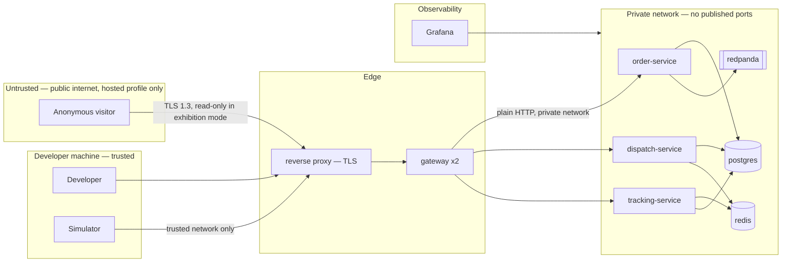

# Security

**Phase:** 9 · **Date:** 2026-08-08
**Reviewing:** Phases 5, 7 and 8. Six amendments were sent back upstream and applied.

---

## The adversary in this system

A conventional threat model assumes an attacker who wants data, money or disruption. Applied
literally here it produces a very short and very boring document: there is no confidential
data, no money, no users, no PII, no uploads, and no third-party integration. The honest
conclusion would be "nothing much to protect", and stopping there would be a mistake.

This system has **two distinct adversaries**, and they need separate treatment because the
controls that address one do nothing for the other.

**Adversary 1 — the ordinary attacker**, relevant *only if* a public demo is hosted (F-18).
Locally, the attack surface is `localhost` and the adversary is hypothetical. Hosted, the
surface is real and the system is unusually exposed, because A-03 removed authentication
entirely. This half is conventional and is treated conventionally below.

**Adversary 2 — self-deception**, relevant always, and the one that actually threatens this
project. Phase 2 established that the unacceptable outcomes here are epistemic: a silent
invariant violation, a self-referential proof, an unreproducible published number. A system
that *claims* correctness it does not have is the failure mode, and no firewall addresses it.

Both are modelled. The second gets its own STRIDE-equivalent table, because the standard
categories do not fit threats to the truth of a claim — and that table found the two most
serious issues in this document.

---

## Trust Boundaries

*Notice:* there is exactly **one** boundary crossing from untrusted to trusted — the reverse
proxy — and it exists only in the hosted profile. Locally there is no untrusted zone at all.
Everything inside `internal` communicates in plaintext over the Compose network and **must
never publish a port to the host** in the hosted profile; that single rule prevents more
attacks than every other control in this document combined.

---

## Threats — Adversary 1 (conventional)

Ranked by likelihood × impact. Threats are scoped `[LOCAL]`, `[HOSTED]` or both.

| # | Boundary | STRIDE | Threat | Likelihood | Impact | Mitigation | Status |
|---|---|---|---|---|---|---|---|
| T-01 | Public → gateway `[HOSTED]` | **S** | **Total identity spoofing.** `X-Courier-Id` is unverified (A-03), so anyone can impersonate any courier, accept offers, cancel assignments, or report false positions | **Certain** | High | **Exhibition mode** — hosted profile serves a read-only surface (GET + WebSocket only); all mutating endpoints are refused at the proxy. The simulator drives state server-side | **Mitigated by design** — see Amendment A-6 |
| T-02 | Public → infra `[HOSTED]` | **E/I** | **Published infrastructure ports.** Postgres 5432, Redis 6379, Redpanda 9092 exposed to the internet. Redis with no password is a well-known trivially-exploited target | Medium (a Compose default away) | **Critical** | Hosted Compose overlay publishes **only** the proxy's 443. Explicit `ports:` removal for every infra service, verified by a CI check on the hosted overlay | **Mitigated** — Amendment A-4 |
| T-03 | Public → actuator `[HOSTED]` | **I** | **Actuator endpoint exposure.** Spring Boot's `/actuator/env`, `/heapdump`, `/threaddump` leak configuration, secrets and memory contents | Medium | **Critical** | `management.endpoints.web.exposure.include=health,prometheus` only. `/actuator/prometheus` is proxy-restricted to the Grafana network | **Mitigated** — Amendment A-3 |
| T-04 | Client → logs | **T/R** | **Log injection via `X-Correlation-Id`.** The header is client-supplied and written to logs. CRLF in it forges log entries — which in *this* system means **fabricating evidence**, the worst possible outcome given Adversary 2 | Medium | **High** | Validate as strict UUID v4; reject with `400` otherwise. Never log the raw header | **Mitigated** — Amendment A-1 |
| T-05 | Public → gateway `[HOSTED]` | **D** | **Resource exhaustion via order creation.** Unbounded orders fill a €10 VPS's disk; unbounded courier registration fills Redis, which runs `noeviction` and will hard-fail | High if writes are public | High | Exhibition mode removes public writes entirely (T-01). Plus: global order cap in the hosted profile, disk-usage alert | **Mitigated** |
| T-06 | Config → runtime | **D** | **Rate-limit bypass flag leaks into the hosted profile.** The stress profile disables rate limiting by design; that flag reaching a public deployment removes the only DoS control | **Medium** — a config mistake, not an attack | High | Startup refuses to boot if rate limiting is disabled *and* the public profile is active. Logged loudly at `ERROR` in every case where limits are off | **Mitigated** — Amendment A-5 |
| T-07 | Client → gateway | **D** | **Unbounded `Idempotency-Key`.** Client-supplied, stored as a PK component. A 10 MB key is a cheap storage and index-bloat attack | Low | Medium | Cap at 255 chars, charset `[A-Za-z0-9_-]`, reject otherwise | **Mitigated** — Amendment A-2 |
| T-08 | Client → gateway | **D** | **WebSocket connection exhaustion.** 10 concurrent per IP, but no global cap; a handful of IPs exhausts file descriptors | Low `[LOCAL]` / Medium `[HOSTED]` | Medium | Global cap of 2 000 concurrent per gateway (4× the 500 target); `503` on upgrade beyond it | **Mitigated** |
| T-09 | Build → runtime | **T** | **Supply-chain compromise** via a malicious or vulnerable Maven/npm dependency, or a mutable Docker base tag | Low | High | Dependabot on; OWASP Dependency-Check in CI failing on High; **Docker base images pinned by digest, not tag** | **Mitigated** |
| T-10 | Repo → public | **I** | **Secrets committed** to a public repository | Low | High | `gitleaks` in CI. No real secrets exist — all credentials are local-only development values, generated per-deployment for the hosted profile | **Mitigated** |
| T-11 | Service → Postgres | **E** | **Over-privileged database user.** A single superuser across all three schemas means a SQL flaw in one service reaches every table | Low | Medium | One role per service, granted only on its own schema. `dispatch_svc` cannot write `orders.orders` — **which also enforces the module boundary from Phase 5 structurally rather than by convention** | **Mitigated** |
| T-12 | Client → gateway | **T** | SQL injection | Very Low | Critical | Parameterised queries throughout (JPA/JDBC binding). No string-built SQL anywhere. ArchUnit rule forbids raw string concatenation into query methods | **Mitigated** |
| T-13 | Public → map `[HOSTED]` | **I** | XSS via reflected address fields in the map UI | Low | Low | React escapes by default; no `dangerouslySetInnerHTML`. Address fields capped at 200 chars and treated as text | **Mitigated** |
| T-14 | Courier → courier | **E** | **Horizontal privilege escalation**: courier A accepting an offer addressed to courier B | Medium (trivial without auth) | **High** — a direct INV-1 hazard | Ownership check is a predicate **inside the claim transaction** (`AND courier_id = :caller`), not a separate query. Locally this is a correctness control; hosted, exhibition mode removes the surface | **Mitigated** |
| T-15 | Anyone → Grafana `[HOSTED]` | **E** | Default Grafana `admin/admin` | Medium | Medium | Anonymous **read-only** viewer role; admin password generated per deployment; sign-up disabled | **Mitigated** |
| T-16 | Public → gateway `[HOSTED]` | **D** | Volumetric DDoS | Low | Medium | **Accepted.** No WAF, no CDN — neither fits €10/month. A €10 demo being knocked offline costs nothing and has no users to disappoint | **Accepted** |
| T-17 | Client → gateway | **R** | A courier denies having accepted an offer | Low | Low | **Accepted.** With no authentication, non-repudiation is impossible by construction. The event log records *what the system was told*, which is all that is claimed. Stated plainly rather than implied | **Accepted** |

**T-01 is the defining threat**, and it is worth being blunt: a public deployment of this
system with writes enabled is trivially and totally compromisable by anyone with `curl`. The
mitigation is not a control bolted on — it is a deployment decision (exhibition mode, A-6)
that removes the surface. That decision belongs to Phase 10, which is why it is flagged here
rather than assumed.

---

## Threats — Adversary 2 (epistemic integrity)

STRIDE does not fit threats to the truth of a claim, so this table uses categories that do.
**These are the threats that actually matter for this project**, and two of them produced the
most consequential findings in the phase.

| # | Category | Threat | Likelihood | Impact | Mitigation | Status |
|---|---|---|---|---|---|---|
| **E-01** | **Silent violation** | An invariant is violated at runtime and nothing counts it. Every published number becomes a lie | Medium | **Critical** | Four of six invariants are enforced by database constraints and cannot be violated silently — the write fails. INV-4 and INV-5 are process properties and rely on counters, so **each counter is deliberately made non-zero in a test** (FR-015). A counter never observed firing is untested code | Mitigated |
| **E-02** | **Circular proof** | Validation compares the system against itself and always passes | **High** — it was the original design | **Critical** | Phase 6 Blocker F-2: reconciliation now reads three independent sources, including Kafka consumed from offset 0 and the simulator's ground truth. ArchUnit forbids the job importing service domain code | **Mitigated — was live** |
| **E-03** | **Suppressed evidence** | Chaos or concurrency tests become flaky and get disabled; nothing goes red, and the failure-correctness claim silently evaporates | **High** | **Critical** | Chaos suite runs in its own CI job that may be slow but may never be skipped. **`@Disabled` on any test tagged `chaos` or `concurrency` fails the build**, so silencing a test requires deleting it visibly | Mitigated |
| **E-04** | **Untriggered test** | The concurrency test passes because the race never occurred, not because it was handled | **High** — the default outcome | **Critical** | FR-021: the stress test **asserts that failed atomic claims > 0**. Zero contention fails the run. An untriggered race is not a passed test | Mitigated |
| **E-05** | **Unreproducible number** | A README p99 that no reader can obtain, destroying credibility of everything else | Medium | High | Load profiles committed as code with fixed seeds; README states the exact command and the hardware. NFR-008 requires byte-identical output from identical seeds | Mitigated |
| **E-06** | **Contaminated benchmark** | Numbers measured with observability off, rate limits disabled, or on an idle machine, then reported as representative | Medium | High | The load harness records the **full active configuration** into the report header, including whether rate limiting was on. A report whose config differs from the documented profile is marked non-canonical | Mitigated |
| **E-07** | **Convenient omission** | A missed target quietly disappears from the README | Medium | **High** — it is the one thing that makes the passing numbers believable | F-14 requires publishing misses. The results table is generated from the harness output, not hand-written, so a row cannot be omitted without editing generated output | Mitigated |
| **E-08** | **Retrospective bug story** | No bug was recorded when it happened, so one is reconstructed or embellished at the end | **High** | Medium | `docs/bug-log.md` kept from Sprint 2, entries written the day they occur, with commit SHAs | Mitigated |

E-02 is the one that was **live** rather than hypothetical — the original reconciliation
design would have passed, reported zero variance, and proven nothing. It was caught in Phase
6, which is the strongest argument in this document set for having run the architecture
review as a separate phase.

E-04 deserves equal weight and is subtler. A concurrency test that passes tells you nothing
unless you know the race actually happened; the assertion `failedClaims > 0` is what converts
it from a test that *can* pass into a test that *must have been exercised*.

---

## Control Review

### Authentication

**Not implemented** (A-03), and the standard checklist is therefore inapplicable — no
password storage, no lockout, no MFA, no reset tokens, no sessions. There is nothing to get
wrong because there is nothing there, which is a real (if unusual) security property.

What matters is that the omission is **contained**. Adding real authentication later touches
one gateway filter and one config block: identity is already resolved into a principal object
before any domain code sees it, so `sub` from a JWT would drop into the same place the header
does today. No domain code, no schema, no test changes beyond fixtures.

**What production would require**, recorded so this reads as a decision: OIDC via Keycloak or
an equivalent; JWT validation at the gateway with rotating JWKS; short-lived access tokens
with refresh rotation; revocation on logout; TLS everywhere. Roughly 12 hours and one
container — priced and consciously declined.

### Authorization

This is the control that **is** implemented, and it is enforced properly.

- **Deny by default.** Unlisted routes return `404`, not `200`. Spring Security's default-deny
  chain is used even without authentication.
- **Server-side on every request**, never inferred from client state.
- **Object-level checks on every fetch by ID** — the single most common real-world flaw. Every
  `GET /orders/{id}` carries `AND merchant_id = :caller` in the query itself rather than as a
  post-fetch comparison, so a missing check is a missing predicate rather than a silently
  skipped `if`.
- **Ownership checks on mutations live inside the claim transaction** (`AND courier_id =
  :caller` in the conditional `UPDATE`). Not a pre-check. This is both an authorization
  control and a race-condition control, and it is the same line of SQL.
- **Database-level privilege separation** (T-11): each service's role is granted only on its
  own schema, so the Phase 5 module boundaries are enforced by Postgres rather than by
  discipline. `dispatch_svc` writing `orders.orders` fails with a permission error at the
  first attempt in development, not in review.

No roles, no privilege changes, no admin actions — so those checklist items are genuinely
inapplicable rather than skipped.

### Input validation

| Control | Position |
|---|---|
| Server-side allow-list validation | Yes — Bean Validation on every request DTO |
| Parameterised queries | Yes, everywhere. ArchUnit rule forbids string concatenation into queries |
| Coordinate bounds | `lat` ∈ [-90,90], `lon` ∈ [-180,180], then bounding-box check → `ORDER_OUT_OF_BOUNDS` |
| Header validation | **`X-Correlation-Id` must be a UUID** (A-1); **`Idempotency-Key` ≤ 255 chars, `[A-Za-z0-9_-]`** (A-2) |
| Free-text fields | Addresses and cancel reasons capped at 200 chars, stored as text, never interpreted |
| Request size | 64 KB cap globally; 256 KB for the batch location endpoint |
| Output encoding | React escapes by default; no raw HTML injection path exists |
| File uploads | **None in the system** — removes an entire class |
| SSRF | **No user-supplied URL is ever fetched.** The only outbound HTTP is OSM tiles from a compile-time-configured host |

### Secrets

- Nothing real in source control; `gitleaks` in CI enforces it.
- Local credentials are development-only values in `.env.example`, committed deliberately so
  `docker compose up` works from a cold clone (NFR-007). **This is a decision with a
  tradeoff**: it makes the one-command requirement achievable and would be unacceptable if
  those credentials ever reached a network. The hosted overlay therefore generates its own at
  deploy time and shares nothing with the local defaults.
- Per-service database roles with least privilege (T-11).
- Rotation: not applicable locally; hosted credentials are regenerated on each deployment,
  which is simpler than rotating them.

### Encryption

| Layer | Position |
|---|---|
| In transit, public → proxy `[HOSTED]` | **TLS 1.3**, automatic certificates via Caddy or Traefik. HSTS enabled. €0 |
| In transit, inside the Compose network | **Plaintext, accepted.** mTLS between services would demonstrate nothing this project is about and would cost hours plus a certificate lifecycle. The network is not reachable from outside (T-02) |
| At rest | **None.** No confidential data exists. Disk encryption is the host's concern |
| Field-level | Not applicable — nothing sensitive enough to warrant it |

### Audit logging

The event log exists for **correctness** rather than compliance, which changes what it needs:
completeness and independent queryability, not tamper evidence or signing.

- Every state transition emits a domain event committed with its state change (FR-013).
- Every log line carries the correlation ID, propagated across services and into Kafka headers.
- **Authorization failures are logged with the attempted and actual identity** — one of the
  few genuinely security-relevant events in the system.
- **No credentials or tokens exist to leak into logs.** Error paths were still reviewed for
  header echoing, since exception handlers are where leaks usually occur, and the raw
  `X-Correlation-Id` is never logged (T-04).
- Retention: for the life of a run.

### Availability

| Control | Position |
|---|---|
| Rate limiting | Per-identity sliding window (Phase 8). Framed as a correctness guard against a runaway simulator, not as an attack defence |
| Payload caps | 64 KB / 256 KB |
| Request timeouts | 2 s on internal calls, failing closed (NFR-012) |
| **Slow-dependency behaviour** | Defined explicitly, and this is the one that matters most: timeouts that cascade cause more outages than hard failures. Every dependency has a bounded timeout and a defined degraded mode (Phase 5's degraded-modes table). Toxiproxy tests **latency injection**, not only hard partition, precisely to exercise it |
| Global WebSocket cap | 2 000 per gateway (T-08) |
| Redis `noeviction` | Deliberate: fail loudly rather than silently drop geo entries |

---

## OWASP Top 10

| Risk | Applies? | Control | Where enforced |
|---|---|---|---|
| **A01 Broken access control** | **Yes — the primary conventional risk.** No authentication means every access control is object-level or nothing | Ownership predicates inside queries and claim transactions; deny-by-default routing; per-service DB roles. Hosted: exhibition mode removes the mutating surface | Gateway + service SQL + Postgres grants |
| **A02 Cryptographic failures** | Partially | TLS 1.3 at the edge `[HOSTED]`. No data at rest warrants encryption; no secrets to protect. Internal plaintext is an accepted, network-isolated decision | Reverse proxy |
| **A03 Injection** | Yes | Parameterised queries + ArchUnit rule; React output escaping; **log injection specifically addressed** (T-04) — the injection vector that actually applies here, given no SQL string building exists | Persistence layer, gateway |
| **A04 Insecure design** | **Yes, and consciously** | Absent authentication is an insecure design *by choice*, documented with its blast radius and containment. Exhibition mode is the compensating design control. The interesting inversion: the system's *correctness* design is unusually strong — races and idempotency are handled at a level most production systems do not reach | Design-level |
| **A05 Security misconfiguration** | **Yes — the highest-likelihood risk in practice** | Actuator exposure restricted (A-3); infra ports unpublished (A-4); Grafana anonymous read-only (T-15); rate-limit-bypass refused in public profile (A-5). All four are configuration mistakes, not code flaws, which is why they are CI-checked | Compose overlay + CI check |
| **A06 Vulnerable components** | Yes | Dependabot; OWASP Dependency-Check failing on High; **Docker images pinned by digest** | CI |
| **A07 Identification and authentication failures** | **Yes — accepted in full** | No authentication exists (A-03). Rated Critical if hosted with writes; reduced to Low by exhibition mode. Stated as an accepted risk, not mitigated | Deployment decision |
| **A08 Software and data integrity failures** | Yes | Pinned digests; `gitleaks`; CI on every push; no auto-update mechanism, no deserialisation of untrusted data (JSON only, no Java serialisation anywhere) | CI + code |
| **A09 Logging and monitoring failures** | **Yes — and it is where this system is strongest** | Full distributed tracing, invariant counters, sweeper lag, outbox depth, dedup counters. The epistemic table (E-01…E-08) is essentially an extended treatment of this risk | Observability stack |
| **A10 SSRF** | **No** | No user-supplied URL is ever fetched. Only outbound HTTP is OSM tiles from a compile-time-configured host | n/a |

The pattern worth naming: **A05 is the real risk and A07 is the accepted one.** This system's
danger is not a clever attack, it is a `ports:` line left in a Compose overlay — which is why
the four A05 controls are enforced by a CI check on the hosted overlay rather than by
remembering.

---

## Compliance Mapping

| Obligation | Source | Applies? | Reason |
|---|---|---|---|
| Lawful basis for processing | GDPR Art. 6 | **No** | No personal data of any natural person. Couriers, merchants and orders are simulator-generated |
| Right of access / erasure | GDPR Arts. 15, 17 | **No** | No data subject exists |
| Breach notification | GDPR Art. 33 | **No** | No personal data to breach |
| Data processing agreements | GDPR Art. 28 | **No** | No subprocessors — no runtime third-party service |
| Consent for non-essential processing | ePrivacy | **No** | No cookies, no analytics, no tracking in the demo UI |
| PCI DSS | — | **No** | No payment data (non-goal) |
| Data residency | Various | **No** | No constraint |

**No compliance obligation applies, and none is unmet.** This is a genuine property of a
system with entirely synthetic data, not an unexamined assumption — Phase 2 checked it
explicitly, including the case that catches most B2B tools (one EU employee's records
creating GDPR exposure regardless of what the product is called). There are no employees, no
customers, no records of anyone.

One caveat worth stating: **if the simulator were ever seeded from real courier data**, every
row above changes. The synthetic-data property is load-bearing for this entire section and
should not be quietly abandoned for realism.

---

## AI-Specific Concerns

**Not applicable.** The system uses no model, makes no inference call, and has no prompt
anywhere (A-08). Candidate ranking is deterministic distance-and-availability scoring.

Recorded rather than omitted because the absence is deliberate and load-bearing: an LLM in the
dispatch path would introduce non-determinism, which would break NFR-008's reproducibility
requirement and therefore invalidate every published measurement. **Determinism and AI are in
direct conflict for this project**, and determinism wins.

---

## Required Changes to Earlier Phases

Six amendments, all applied.

| # | Document | Current | Required change | Threat |
|---|---|---|---|---|
| **A-1** | `06-api-contract.md` | `X-Correlation-Id` accepted and echoed | **Must be a valid UUID v4**; `400 VALIDATION_FAILED` otherwise. Raw header never logged | T-04 log injection — *fabricating evidence* in a system whose output is evidence |
| **A-2** | `06-api-contract.md` | `Idempotency-Key` unconstrained | Cap 255 chars, charset `[A-Za-z0-9_-]`, `400` otherwise | T-07 storage and index-bloat |
| **A-3** | `04-architecture.md` | Actuator endpoints unspecified | Expose **only** `health` and `prometheus`; `prometheus` restricted to the observability network | T-03 config and memory disclosure |
| **A-4** | `04-architecture.md` | Compose publishes infra ports for local convenience | Hosted overlay publishes **only** the proxy's 443. CI check asserts no infra service declares `ports:` in the hosted overlay | T-02 — the single highest-impact hosted threat |
| **A-5** | `06-api-contract.md` | Rate limiting disabled by profile flag | Startup **refuses to boot** when limits are disabled *and* the public profile is active; `ERROR` log whenever limits are off | T-06 config leak |
| **A-6** | `04-architecture.md` → Phase 10 | Hosted profile undefined | Define **exhibition mode**: hosted surface is read-only (GET + WebSocket); mutating endpoints refused **at the reverse proxy**; the simulator drives state server-side, reaching the gateway directly on the internal network | T-01, T-05, T-14 — removes the surface rather than defending it |

> **Correction from the Phase 13 review (finding R-01).** As first written, A-6 did not say
> *where* the refusal happens. Implemented inside the gateway it would have blocked the
> server-side simulator as well as the public, leaving the hosted demo showing a permanently
> empty map — a failure invisible until someone visited. Refusal is at the proxy; the
> simulator connects to `http://gateway:8080` internally. A CI check asserts the simulator's
> base URL in the hosted overlay is the internal service name.

**A-6 is the most valuable finding in this phase**, and it is a design change rather than a
control. Exhibition mode eliminates spoofing, resource exhaustion and horizontal privilege
escalation *simultaneously and at zero cost*, because a demo of an autonomous simulation does
not need public writes to be interesting — arguably it is better without them, since a
visitor cannot disturb the running demonstration. Phase 10 must cost and specify it.

---

## Controls With Hosting Cost Implications

Flagged for Phase 10 so it prices the architecture actually agreed to.

| Control | Cost | Note |
|---|---|---|
| TLS termination + automatic certificates | **€0** | Caddy or Traefik with Let's Encrypt; ~32 MB |
| Reverse proxy for exhibition mode | **€0** | Same container. Read-only enforcement is a routing rule |
| WAF | **Not affordable** — €20+/month alone | **Omitted.** T-16 accepted |
| CDN / DDoS protection | €0 on a free tier, but adds a dependency | Optional; not required |
| Per-service DB roles | €0 | Configuration only |
| Secret generation at deploy | €0 | Script |
| **Total added hosting cost of the security posture** | **€0** | The entire posture fits the budget, because its two strongest controls — exhibition mode and unpublished ports — are decisions rather than products |

---

## Summary

**Top five threats:**

1. **T-01 / A07 — total identity spoofing if hosted with writes.** Certain, high impact.
   Resolved by exhibition mode (A-6) rather than by a control.
2. **E-02 — circular proof.** Was live in the design until Phase 6 caught it. Critical,
   because it would have passed silently.
3. **T-02 — published infrastructure ports.** One Compose line from critical compromise; now
   CI-checked.
4. **E-03 / E-04 — suppressed or untriggered evidence.** High likelihood, critical impact, and
   invisible when they occur. Addressed by build-level enforcement rather than discipline.
5. **T-03 — actuator exposure.** Classic, cheap, and now closed.

**Accepted rather than mitigated:** volumetric DDoS (T-16, no WAF budget); non-repudiation
(T-17, impossible without authentication); internal plaintext (network-isolated);
authentication itself (A-03, contained and priced at ~12 h).

**Compliance obligations unmet:** none — and none apply, because no natural person's data
exists anywhere in the system.
