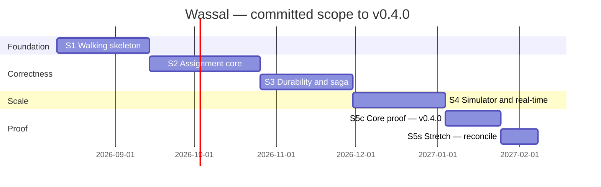

# Delivery Plan

**Phase:** 12 · **Date:** 2026-08-08 · **Amended 2026-08-09** (pre-Sprint-1 review, items 1–6)

> **This plan was reset.** The original committed five sprints, 245 h nominal, at 20 h/week
> over 10–12 weeks. Three things were wrong with that and all three are corrected below:
> the 245 h total contained an arithmetic error, the estimate ignored the cost of unfamiliar
> work, and 20 h/week was not the developer's real availability.

**Velocity:** **13 h/week** — the developer is a full-time master's student with parallel
commitments (daily English practice, sustained open-source contribution, technical reading).
The original 20 h/week was aspirational.

**Committed scope:** **`v0.4.0`** — Sprints 1–4 plus the core proof subset. **238 h nominal,
≈313 h realistic, ~24 weeks** (ADR-0010). Sprint 5's remainder is stretch.

### The arithmetic error, recorded

The original plan headlined Sprint 1 at **45 h**. Its backlog items sum to **59 h**. The
error was never caught, and it propagated: the plan's 245 h total was really **260 h**, which
is exactly the Phase 1 top-down estimate. The Phase 13 review "reconciled" the 260-vs-245
difference as the road-graph simplification landing in the detailed plan — a plausible story
for a discrepancy that was actually a mis-addition.

Two lessons worth keeping. **A bottom-up estimate that happens to match a top-down one is not
corroboration if nobody re-added the column.** And a reconciliation that explains a
discrepancy without checking the arithmetic is a rationalisation. Every sprint total below has
been re-summed from its items.

---

## Sequencing Rationale

Two failure modes govern this plan. Building all the infrastructure before anything is
visible produces four weeks with nothing to show and no evidence the pieces fit. Building all
the visible parts first produces a beautiful map over an assignment core that has never been
tested under contention. Both are avoided by the same rule: **attack the riskiest unknown
first**, and make every sprint end with something runnable.

The risk each sprint retires, in order:

| Sprint | Retires the risk that… | Why it must come this early |
|---|---|---|
| **S1** | …the nine-container architecture does not actually fit together, and Kafka operations (F-20 gap) prove harder than budgeted | An integration surprise in week 8 is fatal; in week 2 it is a schedule adjustment. Also front-loads the largest unknown-unknown |
| **S2** | …**the atomic claim does not hold under contention** — the project's entire thesis | If INV-1 cannot be proven, everything after it is decoration. This is the single most important risk in the project and it is retired second |
| **S3** | …durability across process death does not work — the timer survives, the saga resumes | Depends on S2's claim existing. Cannot be tested before there is something to interrupt |
| **S4** | …the real-time layer does not scale across gateway instances (F-20 gap), and the simulator is bigger than estimated | The second-largest unknown. Deliberately *after* correctness (C-8) |
| **S5** | …the evidence cannot actually be produced, measured or explained | Everything before this builds the system; this sprint builds the *proof*, which is the deliverable |

**The ordering constraint from F-21 is load-bearing and uncomfortable.** The live map is the
most rewarding thing to build and appears in Sprint 4, not Sprint 1. It is withheld
deliberately until INV-1…INV-6 are proven, because a map over an unproven assignment core is
a worse artifact than no map — it invites a Reader to believe something has been demonstrated
when it has not. Expect to want to break this rule in week 3. Do not.

**Correctness before visuals is not a preference here; it is the difference between evidence
and decoration.**

### Why v0.4.0 is the finish line, not the fallback

The original plan's first "done" moment was ~25 weeks away at realistic velocity, with nothing
tagged as complete before then. **Risk R-1 — motivation decay at ~70% — is the project's
highest-rated residual risk, and the plan was walking directly into it.**

ADR-0010 promotes v0.4.0 from contingency to plan. The difference is not cosmetic: a
contingency is something you fall back to in failure; a plan is something you finish. Stretch
items are now pulled *in* on success rather than dropped *out* on failure, which reverses the
psychological direction at exactly the point where a solo project usually dies.

---

## Milestones

| # | Milestone | Outcome | Demonstrates | Nominal | Realistic | Weeks |
|---|---|---|---|---:|---:|---:|
| M1 | Walking skeleton | One order flows end-to-end through all four services via Kafka and gets trivially assigned | 52 h | 66 h | 5 |
| M2 | Assignment core proven | Atomic claim, geo search, offer lifecycle. INV-1…INV-3 proven under 5 000 concurrent attempts, **plus the Redis-lock comparison** | 52 h | 72 h | 6 |
| M3 | Durability proven | Durable expiry surviving restart, cancellation saga with resumption. INV-4…INV-6 | 51 h | 68 h | 5 |
| M4 | Real-time and simulation | Simulator on the road graph, hot-path ingest, cross-instance fan-out, observability | 49 h | 65 h | 5 |
| M5c | **Core proof — committed** | Chaos suite, invariant counters, README, bug story, demo script | 34 h | 42 h | 3 |
| | **`v0.4.0` — committed total** | | **238 h** | **313 h** | **24** |
| M5s | *Proof — stretch* | *Three-source reconciliation, k6 load report* | *20 h* | *26 h* | *+2* |

### How "realistic" is derived

The multiplier is applied **selectively**, not uniformly — inflating every task by 1.75×
would be as unexamined as the original estimate.

| Category | Nominal | Multiplier | Basis |
|---|---:|---|---|
| Tasks touching the three experience gaps (F-20) — Kafka ops, distributed locking, WebSocket scaling | **65 h** | **×1.75** | Unfamiliar work runs 1.5–2× as a rule. These are the tasks where the developer has no production experience to draw on |
| Everything else | 173 h | ×1.15 | General first-time-with-this-stack friction — Testcontainers setup, Compose health checks, Gradle multi-module |
| **Total** | **238 h** | | **≈313 h** |

At 13 h/week that is **24 weeks**. Applying the same method to the *original* 260 h scope gives
~340 h and ~26 weeks, which is why the reset was necessary rather than optional.

---

## Roadmap

**These are five-week stages, not two-week sprints.** The "Sprint" labels are kept because
every cross-reference in the document set uses them and renumbering would break those, but
the durations below are the real ones. Sprint 2 is **six weeks**, not two.

| Sprint | Weeks | Calendar (from Mon 2026-08-10) | Nominal | Realistic | Tag |
|---|---|---|---:|---:|---|
| **S1** Foundation | 1–5 | **10 Aug – 13 Sep 2026** | 52 h | 66 h | `v0.1.0` |
| **S2** Assignment core | 6–11 | **14 Sep – 25 Oct 2026** | 52 h | 72 h | `v0.2.0` |
| **S3** Durability | 12–16 | **26 Oct – 29 Nov 2026** | 51 h | 68 h | `v0.3.0` |
| **S4** Simulator + real-time | 17–21 | **30 Nov 2026 – 3 Jan 2027** | 49 h | 65 h | `v0.3.5` |
| **S5c** Core proof | 22–24 | **4 Jan – 24 Jan 2027** | 34 h | 42 h | **`v0.4.0`** |
| | | **Committed: 24 weeks** | **238 h** | **313 h** | |
| *S5s* stretch | *25–26* | *25 Jan – 7 Feb 2027* | *20 h* | *26 h* | *`v0.5.0`* |

**Read the calendar, not the hours.** The single most useful correction in this amendment is
that **Sprint 2 is six weeks long.** At 13 h/week and 72 realistic hours, the atomic claim and
its proof occupy a month and a half. A plan that says "2 weeks" invites the developer to
conclude in week 3 that they are failing, when they are exactly on schedule.

**There is no buffer.** The old plan's two-week buffer was absorbing an estimate that was
itself wrong. The realistic figures above *are* the buffer — they carry the multiplier
explicitly rather than hiding it in slack. If work runs beyond them, the response is the cut
ladder or the 2× rule, not an unstated reserve.

---

## The Walking Skeleton

Built first, in S1. The thinnest slice that touches every architectural layer:

> `POST /v1/orders` → gateway → order-service persists the order **and** an outbox row in one
> transaction → polling publisher emits `OrderCreated` to Redpanda → dispatch-service consumes
> it, dedups on `message_id`, picks the **first courier in the table** (no geo search, no
> offer, no claim) → writes an assignment → emits `AssignmentCreated` → order-service consumes
> it and moves the order to `ASSIGNED` → `GET /v1/orders/{id}` returns `ASSIGNED`.

Deliberately trivial in its *logic* and complete in its *path*. It proves the transaction
boundary, the outbox, the publisher, Kafka round-trip, consumer dedup, cross-service event
flow and the Testcontainers harness — every mechanism the rest of the project modifies rather
than introduces. After this, every later change is a modification, not an integration.

**Explicitly not in the skeleton:** geo search, offers, expiry, the atomic claim, WebSockets,
the map, the simulator. Adding any of them makes the skeleton a project.

---

## Epics

### EPIC-01 — Foundation and walking skeleton
**Goal:** the whole stack starts with one command and one order flows end to end.
**Requirements:** FR-001, FR-002, FR-003, FR-013, FR-014, NFR-007, NFR-009, NFR-010, NFR-011.
**Stories:** US-01, US-02, US-16.
**Definition of done:** cold clone → `docker compose up` → health green in < 2 min; one order
reaches `ASSIGNED` through Kafka; integration test green in CI.
**Risks:** Kafka operations learning curve (R-6); nine-container Compose fragility (R-7).

### EPIC-02 — Assignment core
**Goal:** contention is handled correctly and provably.
**Requirements:** FR-005, FR-006, FR-007, FR-008, INV-1, INV-2, INV-3, NFR-002, NFR-012.
**Stories:** US-03, US-04, US-05, US-07, US-14.
**Definition of done:** 5 000 concurrent accepts against 50 couriers → ≤ 50 assignments, zero
violations, **and `failedClaims > 0` asserted** so the race is proven to have occurred.
**Risks:** the claim is the highest-value and highest-risk code in the project.

### EPIC-03 — Durability, expiry and compensation
**Goal:** nothing is lost when a process dies.
**Requirements:** FR-004, FR-009, FR-011, FR-012, INV-4, INV-5, INV-6, NFR-004, NFR-005.
**Stories:** US-06, US-08.
**Definition of done:** kill `dispatch-service` at t=7 s of a 15 s offer, restart at t=12 s,
offer still expires within ±1 s of t=15 s; saga resumes from `current_step`; reconciliation
reports zero variance.
**Risks:** accept-vs-expire divergence (T-2); saga modelling sloppiness.

### EPIC-04 — Simulator and road graph
**Goal:** realistic, deterministic, reproducible load with independent ground truth.
**Requirements:** FR-018, FR-019, FR-020, FR-021, NFR-008.
**Stories:** US-13, US-15.
**Definition of done:** same seed → byte-identical trajectories; response rates within ±3 pp
of config; stress profile produces observed contention.
**Risks:** **R-3, the largest scope risk in the project.** Mitigated by A-01 and by building
the road-graph asset in S1.

### EPIC-05 — Real-time and observability
**Goal:** live positions reach clients across gateway instances; the system is observable.
**Requirements:** FR-010, FR-015, FR-016, FR-022, FR-023, NFR-003, NFR-006.
**Stories:** US-09, US-10, US-11.
**Definition of done:** ingest on instance B reaches a socket on instance A in < 1 s; 500
concurrent connections; Postgres write rate ≥ 10× below ingest; all six invariant counters
visible on one Grafana panel.
**Risks:** WebSocket scaling gap (F-20); frontend scope creep (R-5).

### EPIC-06 — Proof and hardening
**Goal:** the evidence exists, is measured, and is legible in five minutes.
**Requirements:** FR-017, NFR-001, NFR-005, NFR-008, plus every proof artifact in F-14.
**Stories:** US-12, US-17.
**Definition of done:** four proof reports published with real numbers **including misses**;
reconciliation detects a deliberately corrupted row; README leads with diagram, invariants and
numbers; ≥ 1 bug story written.
**Risks:** R-1 (stall at 70%), R-10 (depth illegible).

---

## Sprint Plan

Five sprints, ~2 weeks each, ~40 h per sprint. Every sprint is a vertical slice ending in a
runnable system.

---

### Sprint 1 — Walking skeleton · 52 h nominal / 66 h realistic · **weeks 1–5, 10 Aug – 13 Sep 2026**

**Goal:** the architecture is real and one order flows through all of it.

| ID | Item | Type | Est. | Requirements |
|---|---|---|---|---|
| S1-01 | Gradle monorepo, modules, version catalogue, Spotless | infra | 4 h | — |
| S1-02 | Compose: `core` profile with health-check ordering and `mem_limit` on every service | infra | 6 h | NFR-007, NFR-011 |
| S1-03 | Flyway migrations: `orders`, `couriers`, outbox, inbox. **Offers, assignments and the partial unique indexes move to S2** — the invariant constraints belong in the sprint that proves them | infra | 3 h | Data model |
| S1-04 | `order-service`: create + status, idempotency keys, state machine | feature | 6 h | FR-001, FR-002, FR-003 |
| S1-05 | Transactional outbox + polling publisher with `SKIP LOCKED` | feature | 5 h | FR-013 |
| S1-06 | Inbox dedup + Kafka consumer with offset-commit-after-effect | feature | 5 h | FR-014, INV-5 |
| S1-07 | `dispatch-service`: trivial assignment (first courier in table) | feature | 3 h | Skeleton only |
| S1-08 | `gateway`: REST passthrough, asserted identity, correlation ID | feature | 4 h | FR-001, NFR-010 |
| S1-09 | Testcontainers harness: Postgres + Redis + Redpanda, truncation between tests | test | 5 h | NFR-009 |
| S1-10 | ArchUnit rules: layering, cross-service imports, no infra mocks | test | 3 h | Standards |
| S1-11 | CI: build, unit, IT, ArchUnit, gitleaks, dependency-check | infra | 4 h | C-7 |
| S1-12 | **Spike: build the OSM road-graph asset** (extract → node/edge JSON) | **spike** | **6 h** | A-01, retires R-3 |
| S1-13 | *(moved to S3 — tracing pays off when debugging the saga and sweeper across services, not while building a linear skeleton)* | — | — | NFR-010 |
| **S1-14** | **`scripts/gen-bug-log.sh`** — parse `git log` for `Bug:` trailers, regenerate `docs/bug-log.md`, plus the CI drift check (item 4) | infra | **2 h** | G-6 |
| **S1-15** | **Measure actual `core` and full-stack memory footprint** on native Fedora Docker; restate NFR-011 against the measurement; re-rate the nine-container risk (item 5) | infra | **1 h** | NFR-011 |

**Exit criteria:** cold clone → `docker compose up` → all health checks green in < 2 min. One
`POST /v1/orders` reaches `ASSIGNED` via Kafka. CI green. Road-graph asset committed.
`gen-bug-log.sh` exists and its CI check passes on an empty log. **NFR-011 restated against a
real measurement.** Tag `v0.1.0`.

**Demonstrable outcome:** a terminal recording — `docker compose up`, one `curl` creating an
order, one `curl` showing it assigned, and the Kafka topic showing both events.

> **S1-12 RESULT (2026-08-09): risk retired in ~2 h of the 6 h timebox, and the risk was
> smaller than estimated.** Overpass returns the road geometry for an 8×8 km bounding box
> directly as JSON in one request — 5,617 ways, 41,398 geometry points — which avoids the
> routing engine *and* the pbf/osmium path the plan assumed would be needed. The committed
> asset is 29,567 nodes / 33,509 edges over one connected component, 2.6 MB. A seeded walk
> covers 12.6 km across 400 real street segments. The grid fallback was built first and is
> retained as `--synthetic` for the case where Overpass is unavailable.
>
> The generalisable lesson: the estimate assumed a country-sized extract. For a city-sized
> bounding box a different tool applies, and nobody checked which regime the project was in.
>
> **S1-12 is deliberately in Sprint 1 despite belonging to Sprint 4's feature.** It is the
> project's largest scope risk (R-3); discovering in week 7 that road-geometry needs a routing
> engine would be a crisis, while discovering it in week 1 is a design adjustment. Timeboxed
> at 6 h — if the asset is not produced in that time, fall back to a simplified grid graph and
> record the compromise.

---

### Sprint 2 — The assignment core · 52 h nominal / 72 h realistic · **weeks 6–11, 14 Sep – 25 Oct 2026**

**Goal:** contention is handled correctly, and proven.

| ID | Item | Type | Est. | Requirements |
|---|---|---|---|---|
| S2-01 | `couriers` availability toggle with the active-assignment guard | feature | 4 h | FR-005 |
| S2-02 | Redis `geo:couriers` (tracking-owned) + `set:available` (dispatch-owned) | feature | 5 h | FR-006, F-3 |
| S2-03 | `RedisGeoCandidateFinder`: GEOSEARCH ∩ available, distance-sorted, deterministic tie-break | feature | 5 h | FR-006, NFR-002 |
| S2-04 | Offer creation with persisted `expires_at`; offer delivery via Pub/Sub | feature | 5 h | FR-007 |
| S2-05 | **`AtomicClaimExecutor`** — conditional update, affected-row check, one transaction | feature | 7 h | **FR-008, INV-1, INV-2** |
| S2-06 | Accept/decline endpoints; authorization folded into the claim predicate | feature | 4 h | FR-008, security |
| S2-07 | Idempotent accept — same command N times → one assignment | feature | 4 h | **INV-3**, FR-014 |
| S2-08 | *(moved to S3 — index rebuild is a recovery feature and belongs with the durability work that tests it)* | — | — | Recovery |
| S2-09 | **`Inv1DoubleAssignmentTest`** — 5 000 concurrent, 50 couriers, `failedClaims > 0` | **test** | 6 h | INV-1, E-04 |
| S2-10 | `Inv2SingleAssignmentPerOrderTest`, `Inv3AcceptIdempotencyTest` (parallel replay) | test | 4 h | INV-2, INV-3 |
| S2-11 | Invariant counters INV-1…INV-3 + deliberate-violation injection test | test | 3 h | FR-015, R-8 |
| **S2-12** | **Redis-lock comparison spike — timeboxed 4 h, immediately after S2-05.** Redis Lua claim script in a *test source set only*; benchmark both under the `Inv1DoubleAssignmentTest` contention profile (throughput, p99); written step-by-step statement of the crash window that decided ADR-0004. **Result appended as an amendment under ADR-0004** | **spike** | **4 h** | **G-5**, ADR-0004 |
| S2-13 | Flyway migration: `offers`, `assignments`, `sagas` + **the three invariant constraints** (moved from S1-03) | infra | 2 h | INV-1, INV-2, INV-3 |

**Exit criteria:** 5 000 concurrent accepts against 50 couriers → ≤ 50 assignments, zero
invariant violations, contention observed. Every rejected attempt got a definite `409`, never
a timeout.

> **SPRINT 2 RESULT (2026-08-09): exit criteria met, `v0.2.0`.**
>
> | Proof | Result |
> |---|---|
> | INV-1 — 5,000 concurrent accepts, 50 couriers | **0 double-assignments**, contention observed |
> | INV-2 — 40 couriers racing one order | **exactly 1 assignment**; 39 lost cleanly |
> | INV-3 — 500 parallel replays of one accept | **exactly 1 assignment**, 499 answered with the original |
> | FR-012 — accept after deadline, offer still `OFFERED` | **refused**, proving `expires_at` is a claim predicate |
> | Rollback — lost courier claim | offer returns to `OFFERED`; no `ACCEPTED` offer without an assignment |
> | Counters | all six exported, each observed non-zero by injection |
>
> **S2-12 measured:** Redis `SET NX` 0.093 ms/attempt vs Postgres conditional update
> 0.940 ms/attempt. **Redis is ~10× faster and ADR-0004 is unchanged** — throughput was never
> the reason, and the crash-window test shows the lock surviving its holder while the Postgres
> courier returns to `AVAILABLE` with no cleanup. Result appended under ADR-0004.
>
> **Three bugs found**, all by the proof suite and all recorded in `bug-log.md`: the order-side
> race being miscounted as an INV-2 violation, concurrent replays answered with `409` instead of
> the original assignment, and sub-second TTLs truncating to zero.

**Demonstrable outcome:** run the concurrency suite live and show the output — attempted,
succeeded, failed-claims, violations = 0. **This is the moment the project becomes worth
showing anyone.** Tag `v0.2.0`.

> **S2-12 is why this sprint is six weeks and not five, and it is worth the hour cost.**
> Distributed locking is one of three stated learning targets (F-20), and ADR-0004 closed it by
> deciding *not* to use a distributed lock. That is the right engineering answer and a thin
> learning outcome on its own. Four hours here converts it into the strongest interview
> artifact in the project: *"I chose Postgres partial unique indexes over a Redis distributed
> lock, here is the crash window that decided it, and here is the benchmark of both."* Left in
> Sprint 5 as a could-have it would not have happened.

---

### Sprint 3 — Durability, expiry and compensation · 51 h nominal / 68 h realistic · **weeks 12–16, 26 Oct – 29 Nov 2026**

**Goal:** nothing is lost when a process dies.

| ID | Item | Type | Est. | Requirements |
|---|---|---|---|---|
| S3-01 | `OfferExpirySweeper`: 250 ms tick, adaptive batch to 500, `SKIP LOCKED`, DB time | feature | 6 h | FR-011, ADR-0005 |
| S3-02 | **Accept-vs-expire resolution** — deadline predicate inside the accept's WHERE | feature | 5 h | **FR-012, A-07** |
| S3-03 | Candidate exhaustion → `UNASSIGNABLE`; re-offer in-process within 200 ms | feature | 4 h | FR-007, INV-4 |
| S3-04 | Pickup / deliver endpoints; courier released exactly once | feature | 4 h | FR-004, INV-6 |
| S3-05 | **`CancellationSaga`** — persisted steps, idempotent compensations, resume from `current_step` | feature | 8 h | FR-009, ADR-0008 |
| S3-06 | Stuck-order gauge (`terminal_at IS NULL AND sla_deadline < now()`) | feature | 2 h | INV-4 |
| S3-07 | Dedicated connection pools for sweeper and publisher | infra | 2 h | F-5 |
| S3-08 | Dedup retention startup assertion (`> kafka_retention + max_retry`) | feature | 2 h | Data model |
| S3-09 | `Inv4NoStuckOrdersTest` — kill mid-offer, restart, assert expiry within ±1 s | test | 5 h | INV-4, NFR-004 |
| S3-10 | `Inv6SingleReleaseTest` — compensation replayed 100× → one release | test | 3 h | INV-6 |
| S3-11 | Accept-at-14.98 s vs sweeper-at-15.00 s race test, both orderings | test | 4 h | FR-012 |
| S3-12 | *(moved to S5c — Toxiproxy belongs with the chaos suite that uses it; process-kill tests in S3-09 need Docker, not network fault injection)* | — | — | NFR-009 |
| **S3-13** | Geo-index rebuild from Postgres on startup (moved from S2-08) | feature | 3 h | Recovery |
| **S3-14** | OTel wiring, correlation propagation into Kafka headers (moved from S1-13) | infra | 3 h | NFR-010 |

**Exit criteria:** kill `dispatch-service` at t=7 s of a 15 s offer, restart at t=12 s → offer
expires within ±1 s of t=15 s and the order is re-dispatched. Saga resumes rather than
restarts. Zero lost orders.

> **SPRINT 3 RESULT (2026-08-09): exit criteria met, `v0.3.0`.**
>
> **The headline demonstration, measured on the live stack:** a 15 s offer was created,
> `dispatch-service` was killed at ~t+2 s and restarted at ~t+10 s, and expiry fired
> **0.134 s after the deadline** — inside NFR-004's ±1 s, having survived the death of the
> process that created it. Nothing in the JVM was holding the deadline; it is a column.
>
> | Proof | Result |
> |---|---|
> | FR-011 — expiry across a restart spanning the deadline | **0.134 s** past deadline |
> | FR-012 — accept before sweep | accept wins, sweeper finds 0 rows |
> | FR-012 — sweep before accept | `410`, no assignment, courier still `AVAILABLE` |
> | FR-012 — 25 concurrent accept-vs-sweep races | every round converged on exactly one coherent world |
> | INV-6 — cancellation replayed 100× | **one** release, one saga row |
> | Saga crash resumption | resumed from `current_step`, not from zero |
> | Re-offer chain | seq 1 expired → 2 expired → 3 offered |
> | Sweeper idempotence | one `OfferExpired` per offer across repeated passes |
>
> All 23 dispatch tests green. Metrics live: `wassal_sweeper_lag_seconds`,
> `wassal_orders_stuck`, all six invariant counters.

**Demonstrable outcome:** a scripted kill-and-recover run, narrated — offer outstanding,
process killed, process restarted, expiry fires on time, order reassigned. **This is the
strongest single demonstration in the project.** Tag `v0.3.0`.

---

### Sprint 4 — Simulator, real-time and observability · 49 h nominal / 65 h realistic · **weeks 17–21, 30 Nov 2026 – 3 Jan 2027**

**Goal:** realistic load, live positions across instances, and the system observable.

Baseline cuts 1 and 2 (ADR-0011) are already applied below: the map is static with 5 s polling,
and Grafana is two panels. That brings the sprint from 55 h to 49 h and leaves it holding
**one** experience gap (WebSocket scaling) rather than two — the simulator is unfamiliar work
but not a named gap, since prior experience includes a calibrated synthetic generator (F-19).

| ID | Item | Type | Est. | Requirements |
|---|---|---|---|---|
| S4-01 | Simulator: road-graph walker, 300 couriers, 15–40 km/h, stops, seeded RNG | feature | 9 h | FR-018, NFR-008 |
| S4-02 | Response behaviour 60/25/15, 5% post-accept cancel; Poisson arrivals with peak | feature | 5 h | FR-019 |
| S4-03 | Ground-truth JSONL sink, independent of service state | feature | 4 h | FR-020, E-02 |
| S4-04 | Stress profile — many orders, few couriers, tight radius | feature | 3 h | FR-021 |
| S4-05 | Location ingest hot path: Redis writes, out-of-order handling by `recorded_at` | feature | 5 h | FR-010 |
| S4-06 | Cold path: batching flusher, partitioned inserts, flush-loss counter | feature | 5 h | FR-010, NFR-003 |
| S4-07 | WebSocket termination, subscription registry, Redis Pub/Sub bridge | feature | 7 h | FR-016 |
| S4-08 | Two gateway instances + reverse proxy in `core`; cross-instance fan-out test | feature | 4 h | F-7, NFR-006 |
| S4-09 | Reconnect semantics: current state on resubscribe, no replay; staleness marker | feature | 3 h | FR-016 |
| S4-10 | React + MapLibre single screen, **static with 5 s polling** — no WebSocket client (cut 1 taken as baseline) | feature | 2 h | FR-022, R-5 |
| S4-11 | Prometheus + Grafana provisioned as code; **two panels** — assignment latency, invariant counters (cut 2 taken as baseline) | infra | 2 h | FR-023 |

**Exit criteria:** 300 simulated couriers moving on real streets; identical seed → identical
run; ingest at 100 msg/s with Postgres writes ≥ 10× lower; position from instance B reaches a
socket on instance A in < 1 s.

> **SPRINT 4 RESULT (2026-08-09): exit criteria met.**
>
> | Proof | Result |
> |---|---|
> | 300 couriers on real Tunis streets | 29,567-node graph, 300 couriers, positions on real geometry |
> | Cross-instance WebSocket fan-out | **confirmed on BOTH instances**, connected directly, bypassing the proxy |
> | NFR-003 write amplification | **8,400 positions in 17 write statements — 494×** (see the NFR-003 clarification in `03-prd.md`) |
> | FR-019 calibration | **59% accept** against a configured 60%; declines and expiries in band |
> | Invariants under sustained simulated load | all six counters **zero** |
> | Cancellation saga under load | 4 of 50 assignments cancelled and compensated |
>
> **NFR-003 was ambiguous and is now restated.** Rows written are necessarily 1:1 with
> positions — nothing is discarded — so the "10× fewer rows" reading was never achievable. What
> batching reduces is write *statements*, which is what the write-amplification challenge is
> actually about. Recorded rather than quietly reinterpreted.

**Demonstrable outcome:** open the map, watch 300 couriers move across Tunis while orders flow
and get assigned. **The first sprint whose outcome is visually impressive — deliberately the
fourth.** Tag `v0.3.5`.

**The simulator stays at 300 couriers** (ADR-0011 withdrew the reduction). 300 couriers
reporting every 3 s *is* the 100 msg/s of NFR-003 — the number was derived, not coincidental.
Cutting to 100 would have dropped ingest to 33 msg/s and quietly invalidated the
write-amplification demonstration while appearing cosmetic.

---

### Sprint 5 — Evidence and hardening · **split into committed and stretch** (ADR-0010)

**Goal:** the proof exists, is measured, and is legible to a stranger in five minutes.

**S5c — committed · 34 h nominal / 42 h realistic · weeks 22–24, 4 Jan – 24 Jan 2027 · tag
`v0.4.0`.** This is the finish line.

**S5s — stretch · 20 h · weeks 25–26 if velocity allows.** Pulled in on success, not dropped
on failure.

| ID | Item | Type | Est. | Requirements |
|---|---|---|---|---|
**Committed (S5c) — 34 h**

| ID | Item | Type | Est. | Requirements |
|---|---|---|---|---|
| S5-03 | Chaos suite: kill dispatch mid-assignment, kill order-service mid-create, kill gateway mid-stream, partition Kafka | test | 8 h | NFR-005, **F-1** |
| S5-11 | Toxiproxy harness: latency injection and hard partition (moved from S3-12) | test | 5 h | NFR-009 |
| S5-06 | Invariant counters INV-4…INV-6 wired and injection-tested | test | 3 h | FR-015 |
| S5-07 | **README as hiring artifact** — diagram, invariants, numbers above the fold | docs | 7 h | **R-10, G-6** |
| S5-08 | Bug story write-up — **generated from `git log` trailers via `gen-bug-log.sh`**, then curated into prose | docs | 2 h | G-6 |
| S5-09 | Demo script + recorded walkthrough (asciinema) — **the committed deliverable under ADR-0009** | docs | 3 h | ADR-0009 |
| S5-12 | Publish measured numbers from the contention harness and chaos suite, **including misses**; mark NFR-001 as not formally load-tested if S5s does not land | docs | 4 h | G-3, F-14, E-07 |
| S5-13 | Ground-truth comparison report (FR-020) — the committed non-circularity artifact | test | 2 h | FR-020, E-02 |

**Stretch (S5s) — 20 h, only if velocity allows**

| ID | Item | Type | Est. | Requirements |
|---|---|---|---|---|
| S5-01 | Reconciliation job — three sources (Postgres, Kafka from offset 0, ground truth) | feature | 8 h | FR-017, F-2 |
| S5-02 | Corrupted-row detection test — proves reconciliation can fail | test | 2 h | FR-017 |
| S5-04 | k6 load profiles + report generator | test | 6 h | NFR-001 |
| S5-05 | Sustained-load measurement run | docs | 4 h | NFR-001 |
| ~~S5-10~~ | ~~Hetzner CX32 in exhibition mode~~ — **dropped** (ADR-0010); closes open question U-1 | — | — | ADR-0009 |

**Exit criteria for `v0.4.0`:** chaos suite green across three kill scenarios with measured
recovery times; all six invariant counters observed non-zero at least once; ground-truth
comparison reports no unmatched records in either direction; README leads with the diagram,
invariants and measured numbers **including anything missed**; at least one bug story written;
recorded walkthrough published.

**If S5s does not land, the README says so explicitly:**

> *System state was validated against ground truth emitted independently by the simulator — a
> component sharing no code, schema or connection with the services under test. The fuller
> three-source reconciliation against Kafka consumed from offset 0 is specified in
> `docs/architecture-review.md` finding F-2 and is not built. Latency figures come from the
> contention harness, not a sustained-load profile; NFR-001 is therefore **not formally
> measured**.*

Both substitutions are weaker than the originals. Stating that plainly is required — F-14
mandates publishing misses, and a quietly-substituted weaker proof is the self-deception
threat this project models as its second adversary.

**Demonstrable outcome:** the repository itself — a stranger clones it, runs one command, and
reads the evidence.

---

## Backlog Traceability

Every Must-have requirement appears at least once. This check is the entire point of the IDs.

| Requirement | Sprint items |
|---|---|
| FR-001…003 | S1-04, S1-08 |
| FR-004 | S3-04 |
| FR-005 | S2-01 |
| FR-006 | S2-02, S2-03 |
| FR-007 | S2-04, S3-03 |
| **FR-008** | **S2-05, S2-06, S2-07** |
| FR-009 | S3-05 |
| FR-010 | S4-05, S4-06 |
| FR-011 | S3-01 |
| **FR-012** | **S3-02, S3-11** |
| FR-013 | S1-05 |
| FR-014 | S1-06, S2-07 |
| FR-015 | S2-11, S5-06 |
| G-6 bug story | **S1-14** (generator), S5-08 |
| FR-016 | S4-07, S4-08, S4-09 |
| FR-017 | S5-01, S5-02 — **stretch** (FR-020 + S5-13 carry the claim in committed scope) |
| FR-018…021 | S4-01…S4-04 |
| FR-020 ground truth | S4-03, **S5-13** |
| G-5 distributed locking | **S2-12** |
| FR-022 | S4-10 |
| FR-023 | S4-11 |
| NFR-001 | S5-12 (contention harness, committed) · S5-04/05 (sustained load, **stretch**) |
| NFR-002 | S2-03 |
| NFR-003 | S4-06 |
| NFR-004 | S3-01, S3-09 |
| NFR-005 | S5-03 |
| NFR-006 | S4-08 |
| NFR-007 | S1-02, CI cold-clone |
| NFR-008 | S4-01 |
| NFR-009 | S1-09, S1-10, S5-11 |
| NFR-010 | S3-14 |
| NFR-011 | S1-02, **S1-15 measurement** |
| NFR-012 | S2-05 |
| INV-1…INV-3 | S2-09, S2-10 |
| INV-4…INV-6 | S3-09, S3-10, S5-01 |

**No orphans.** Every Must-have has at least one backlog item, and every backlog item traces
to a requirement.

---

## Testing Strategy

| Level | Scope | Tools | Target | Gate |
|---|---|---|---|---|
| Unit | State machines, invariant logic, mappers | JUnit 5, AssertJ | **90% on `domain`**, no target elsewhere | Merge |
| Integration | Real Postgres, Redis, Redpanda | Testcontainers | Every FR has ≥ 1 IT | Merge |
| Architecture | Layering, isolation, no infra mocks | ArchUnit | All rules pass | Merge |
| **Concurrency** | Contended claims | JUnit + executor pools | Zero violations **and contention observed** | Merge |
| **Chaos** | Kills, partitions, latency | Testcontainers + Toxiproxy | Recovery < 30 s, zero loss | **Separate workflow — never skipped** |
| Load | Throughput, latency | k6 | Measured, published including misses | Separate workflow |
| Cold clone | One-command start | GitHub Actions | < 2 min | Weekly |
| Frontend | Map components | Vitest | Smoke only | Merge |

Coverage is targeted at `domain` only, deliberately. A global percentage would push effort
into testing mappers and controllers to hit a number, when the value is concentrated in the
state machines and the claim path. **Where coverage is the wrong metric, the invariant tests
are the right one** — and they are pass/fail rather than percentage.

---

## Environments

| Env | Purpose | Data | Deploys from | Access |
|---|---|---|---|---|
| Local | Everything | Simulator-generated, seeded | Working tree | Developer |
| CI | Gates | Ephemeral Testcontainers | `main` on push | GitHub Actions |
| Hosted (optional) | Exhibition demo | Server-side simulator | `main` manually | Public, **read-only** |

No staging (A-06). Nothing user-facing to stage.

---

## Release Strategy

**Versioning:** semantic tags at each sprint boundary — `v0.1.0` (S1), `v0.2.0` (S2), `v0.3.0`
(S3), `v0.3.5` (S4), **`v0.4.0` (S5c — the committed finish line)**, `v0.5.0` (S5s stretch).
Tags double as the "shippable at every boundary" checkpoint from R-1, and after ADR-0010 that
is load-bearing rather than nice-to-have: **the tag is what makes stopping early a completion
rather than an abandonment.**
**Cadence:** continuous to `main`; a tag per sprint.
**Deployment:** `docker compose pull && up -d` on the hosted instance, if it exists.
**Feature flags:** none. Trunk-based with one developer and no users means an incomplete
feature can simply live on `main` unwired.
**Rollback:** `git revert` + recreate, or redeploy the previous tag. There is no data to
migrate back and no user to disrupt — deployment risk here is genuinely near zero, which is
worth stating rather than inventing a blue-green story for a system nobody depends on.
**Migrations:** Flyway, forward-only. No down-migrations, because the reset path is
`docker compose down -v` and a down-migration would be untested code protecting nothing.

---

## Operational Readiness

There is no production and no on-call, so the conventional checklist mostly does not apply.
What must exist before the project is considered complete:

| Item | Required | Note |
|---|---|---|
| Health checks on every service | **Yes** | Compose ordering depends on them |
| The three Grafana panels | **Yes** | They are the evidence surface (FR-023) |
| Six invariant counters, each observed non-zero once | **Yes** | R-8 |
| Sweeper lag alert at 0.5 s | **Yes** | Below the 1 s SLO, so it fires first (F-4) |
| Outbox depth gauge | Yes | Earliest reliable signal of a Kafka problem |
| Runbook | **No** | No operator. The README's demo script serves this purpose |
| Backups verified by restore | **No** | No backups by decision; state regenerates from a seed |
| On-call / paging | **No** | Nothing is depended upon |
| Incident process | **No** | |

Recorded explicitly, because an empty operational-readiness section usually means the work was
forgotten. Here it means the work genuinely does not exist.

---

## Scope Reconciliation — resolved by reset, not by cuts

The original plan tried to close a 5–45 h gap with a 15 h cut ladder. That framing was wrong
in three ways, all corrected:

| Original claim | Reality |
|---|---|
| 245 h of work | **260 h** — Sprint 1's items summed to 59 h, not the 45 h headlined |
| At 20 h/week | **13 h/week** — full-time master's degree plus parallel commitments |
| Gap is 5–45 h | At realistic velocity the original scope was **~340 h ≈ 26 weeks**, against a 10–12 week plan |

**The gap was never closable by cutting 15 h.** It is closed by resetting the finish line
(ADR-0010): committed scope is `v0.4.0` at 238 h nominal / 313 h realistic / **24 weeks**.

### The rebuilt cut ladder

The re-triage in `03-prd.md` (Must ratio 96% → 78%) is what produced a usable ladder. Two
entries from the original were struck as defective (ADR-0011) — cut 3 saved ~0 h and would
have broken NFR-003; cut 5 pre-empted a fallback that `S1-12`'s timebox already guarantees.

| Order | Cut | Saves | In committed scope? |
|---|---|---:|---|
| 1 | Drop FR-023's Grafana entirely — Prometheus endpoint and a screenshot | 2 h | Yes |
| 2 | FR-022 → static map, no polling at all | 2 h | Yes |
| 3 | FR-019 → fixed accept/ignore split, no ±3 pp calibration | 3 h | Yes |
| 4 | NFR-006 → 50 concurrent connections instead of 500 | 2 h | Yes |
| 5 | FR-003 → minimal status endpoint | 1 h | Yes |
| 6 | NFR-002 → no dedicated search benchmark | 1 h | Yes |
| 7 | S5-11 Toxiproxy → process kills only, no network fault injection | 5 h | Yes — **last resort**, it weakens the chaos proof |
| | **Available within `v0.4.0`** | **≈16 h** | |
| — | FR-017 reconciliation, k6 load report | 20 h | Already stretch |

**≈16 h of genuine slack inside committed scope**, every entry with a verified saving and a
stated loss. Cut 7 is marked last resort because it is the only one that touches a proof.

**What is never cut**, unchanged: the atomic claim, durable expiry, the saga, outbox and inbox,
any invariant, any invariant test, the concurrency proof, the chaos proof, the README, the
bug story.

### If it still does not fit

Stop at a sprint boundary and tag. `v0.3.0` (end of Sprint 3, ~16 weeks) is already a
defensible artifact: all six invariants proven, durable expiry demonstrated across process
death, saga resumption working. It lacks the simulator, the real-time layer and the WebSocket
learning target — a real loss, but a complete and honest one.

**Ending at a tag is not failure. Ending mid-sprint is.**

---

## Post-Sprint Watch List

### The 2× rule (item 6)

> **Any task that reaches twice its estimate stops.** Write down which task it was, where the
> time went, and choose explicitly: continue with a revised estimate, cut scope on the task, or
> defer it. Record the choice — a `Bug:` trailer if it was a defect, a note in the sprint log,
> or an ADR if the decision changes the design.

The point is not discipline for its own sake. **The hour estimates above only stay useful if
they are corrected while the project is running.** Without a rule, the 238 h figure silently
becomes fiction around week five and nobody notices until January.

Likely candidates, named in advance so the rule is not a surprise: **`S2-05`** (atomic claim),
**`S3-05`** (cancellation saga), **`S4-07`** (WebSocket fan-out). All three sit on experience
gaps, all three are already carrying a 1.75× multiplier, and hitting 2× on top of that means
the multiplier itself was wrong — which is information worth having in week 8 rather than week 20.

The accumulated record of what ran long is itself good README material: *"the offer sweeper
took three times its estimate because database-time versus JVM-time comparison produced a
class of bug I had not anticipated"* is the kind of thing that reads as experience.

**During the build:**
- **The 2× rule fires and is recorded** — not silently absorbed.
- `bug-log.md` has an entry by the end of Sprint 3. If it is empty, the proof suites are not
  yet adversarial enough — that is a finding, not a success (G-6).
- No `@Disabled` in the proof modules, ever (E-03).
- Cold-clone workflow stays green. It is the only thing enforcing NFR-007.
- **Actual weekly hours are logged.** 13 h/week is an estimate too; if the real figure is 10,
  `v0.4.0` lands at ~30 weeks and Sprint 4 becomes the natural stopping point. Better known in
  October than in January.

**Known deferred items:** CDC via Debezium (ADR-0006, schema already compatible); real
authentication (A-03); hosted demo (ADR-0009); geo-index sharding (30 000-courier tier).
